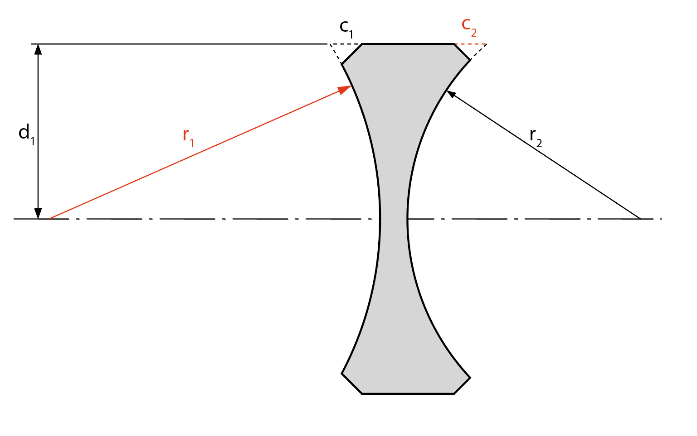

# DESIGN 6400 Journal & Documentation 

Journal for DESIGN 6400 AU24 (Prof. Maria Palazzi). 

## How to Navigate: 

- Use the table of content to quickly jump to different chapters.
- **The journal that summarizes each week's progress can be found at the end** [(**or click here**)](#journals). 
- Use `History` on top right to inspect past versions or make comparasions, there is also a `back to top` button next to it. 

The most recent updated section can be found [here](#32---sufrace-iteration). Note that this is the section that received the most amount of progress with respect to the project, not the course. As such, this may not be the same as the journal content of the corresponding week. Although GitHub version history can be used to inspect past versions, for ease of access, snapshots of this documentation are also created periodically and are stored in [resources](https://github.com/Amarthgul/PersonalCodes/tree/master/OSU/DESIGN6400/resources)

#### Table of content:

- [1 - General](#1---general)
  - [1.1 - Back Focal Distance and Telecentricity](#11---back-focal-distance-and-telecentricity)
  - [1.2 - Eesurgence in Film and Vintage Lenses](#12---resurgence-in-film-and-vintage-lenses)
- [2 - Wavelength Reconstruction](#2---wavelength-reconstruction)
  - [2.1 - Selecting the Distribution](#21---selecting-the-distribution)
- [3 - Ray Propagation](#3---ray-propagation)
  - [3.1 - Explore Ray Transfer Matrix](#31---explore-ray-transfer-matrix)
  - [3.2 - Sufrace Iteration](#32---sufrace-iteration)
    - [3.2.1 - Object to 1st Surface](#321---object-to-1st-surface)
    - [3.2.2 - Iterate Through Surfaces](322---iterate-through-surfaces)
    - [3.2.3 - Image Plane](#323---image-plane)
  - [3.3 - Aspherical Surface](#33---aspherical-surface)
    - [3.3.1 - Even Aspheric](#331---even-aspheric)
    - [3.3.2 - Cylindrical](#332---cylindrical)
  - [3.4 - Aperture Stop](#34---aperture-stop)
- [4 - Imager](#4---imager)
  - [4.1 - Tilt and Shift](#41---tilt-and-shift)
  - [4.2 - OLPF and UVIR Cut](#42---olpf-and-uvir-cut)
  - [4.3 - Film](#43---film)
- [5 - Diffraction](#5---diffraction)
- [Journals](#journals)
- [References](#references)


------------------ 

<br />

## 1 - General 

This project aims to establish a way with which a physical lens can be digitized and used in virtual productions, such as for digital animations and TV/movies post VFX, to emulate the optical characteristics of the physical optics in a virtual setting. 

Vintage lenses are (by definition) no longer in production, there will be a day when those lenses become inaccessible for the people that wish to use them. This project thus holds a certain level of time sensitivity and will need to reach some degree of completion before vintage lenses become antique and eventually history. 

```C++
// TODO: add more explanation 
```

The logic of the application is similar to that of a ray tracer. Lights emit from a point and are collected by a lens then focused onto the image plane, in the ideal case the focused image is still an ideal point. In reality, however, this "point" is susceptible to an array of aberrations, which cause the image to become a larger spot. 

The final image of a scene can be thought as a collection of these spots added (the actual mathematical addition of values) together. Depending on how the lens produces these spots, different phenomena can be seen in the rendered image, which is the source of the “characteristic” of the lens. 

<div align="center">
	
  <p align="center">Figure 1.x. Spot of a point, this is from the sim result of Zeiss Planar 80mm f/2.8 in Zemax.</p>
</div>

In the figure above, an idealized point is placed at the left, emitting light *(this is modified for illustrational purposes, a truly ideal point has no diameter and is thus invisible to human)*. 

The lights reaching the lens are refracted and focused together after exiting the lens. However, zooming in the image may reveal that the beams are not focused together, rather, they are offset to some degree, a common sign of spherical aberration. 

An imager, shown as the dark green line in the figure, is placed right to the lens collecting the existing light. Due to the aberration, the collected image turned out to be a larger spot than the original point. 

Figure 1.x and all the subsequent figures in this document all follow the tradition of showing light paths in a lens layout graph. The left side is the `object space`, light emitted from this side of the lens. After passing through the lens, lights enter the `image space` on the right, and finally reach the imager. 

<br />

### 1.1 - Back Focal Distance and Telecentricity  

In optics, the distance between the last surface of the lens and the image plane is referred to as the `Back Focal Distance` (**BFD** for short, sometimes it is also referred to interchangeably as `Back Focal Length`). 

While BFD may seem to be a free space, in many cases it is rather constrained. For a single lens reflex (SLR) camera, the mirror is placed between the lens and the image plane, reflecting the light up into the prism and then into the viewfinder. This means the BFD must be long enough to accommodate the mirror chamber and the shutter mechanism in front of the image plane. This is the direct reason why 135 format SLRs all have a flange distance of about 40mm. 

For lens design, BFD indriectly ties in with telecentricity. Below is the layout/crossection of the lens Jupiter-12 35mm f/2.8, it has a very shoty BFD and the rays exit lens at a large angle: 

<div align="center">
	
  <p align="center">Figure 1.x. Jupiter-12 35mm f/2.8</p>
</div>

In comparison, longer BFD tend to force the exiting rays to be more telecentric, as demonstrated below: 

<div align="center">
	
  <p align="center">Figure 1.x. Canon 85mm f/1.2</p>
</div>

Note that for the Canon lens in figure 1.2, the last surface is relatively far away from the image plane (long BFD), and the exiting ray at the top have a smaller oblique angle compare to the Jupiter lens. For a pure telecentirc lens, all the exiting rays will be parallel to the optical axis. 

While high telecentricity can be very desirable for some scenarios, such as industrial applications, it also adds difficulty to lens design, especially wide angle lenses with a relatively large image circle. This makes designing wide angle lenses for SLR cameras rather difficult, designers have to resort to the inverse telephoto paradigm, straightening the existing ray for them to reach the image plane. For this reason, most wide angle lenses in the SLR era are bigger and heavier. 

In comparison, rangefinder lenses can have their elements “sink” into the camera and get really close to the image plane, such as the Jupiter-12 example in figure 1.1. More extreme examples can be seen at Zeiss Hologon 16mm f/8, which achieved 16mm wide angle with an astonishingly small body, also with highly non-telecentric design. For those lenses, even if the camera flange distance allows adaptation, the protruding rear element may also be in the way and prevents the camera from taking a picture. 

With the advancement of technology, there are less and less reasons to keep the mirror for digital cameras. Eventually the mirror was removed and digital imaging fully embraced mirrorless cameras. For mirrorless cameras, there is nothing in between the lens and the image plane (aside from some filter glasses like OLPF and UV IR cut, see [chapter 4.2](#42---olpf-and-uvir-cut)). This literated BFD in lens design, allowing lens designers to come up with optics that fully utilizes this space. 

<div align="center">
	
  <p align="center">Figure 1.x. Flange distance for different camera mounts. Showing only the main streams (there were a lot of main streams historically), some of the more proprietary and scarce mounts are omitted to save space</p>
</div>

The liberation of BFD also means that older lenses designed for rangefinder cameras, which tend to have a short BFD and consequently shorter flange distance, can now also be adapted and mounted onto mirrorless cameras. Due to the lack of mirror, even if a lens was originally designed for a system with even shorter flange distance, it can still be adapted onto new mirrorless cameras, such as putting an M42 lens onto a PL mount camera. From the technical aspect, this ensured that a vintage lens can be adapted onto almost any modern camera and is one of the driving forces for the resurgence. 

<br />

### 1.2 - Resurgence in Film and Vintage Lenses 

Placeholder 

<br />

## 2 - Wavelength Reconstruction 

For this application, a pixel on an image or a point in a 3D scene can both be viewed as a light source emiting light.  

In virtually all software the color of the pixel or the color of the point on the 3D object is expressed by RGB value (although underlaying implementations may vary). However, in reality, the color of the light is determined by the distribution and the intensity of every wavelength. This is important because refraction is dependent on wavelength, as light of different wavelength will be bent differently when entering another material with a different refraction index. 

RGB can be treated as 3 Gaussian distributions of wavelengths. With the RGB value on each channel representing the intensity of the peak wavelength, acting as a scale factor for the entire distribution. Integrating over all 3 distributions will then yield a spectral representation of the given RGB color, and the same process can be used to translate the wavelength distribution into RGB value. 

For ease of calculation, it may be fitting to choose the peak wavelength of RGB as: 

$$R = \lambda _{C} = 656.27 \mu m$$

$$G = \lambda _{d} = 587.56 \mu m$$

$$B = \lambda _{F} = 486.13 \mu m$$

These values also allows us to make comparisons with patents much easier, since most modern patents uses $n _D$ and $v _D$ to describe the optical material properties, and $v _D$ is defined using the values above: 

$$v_D = \frac{n _d - 1}{n _F - n _C}$$

Although integrating the 3 Gaussian distribution can be more accurate in calculating the color shift and tint in an optical system, it faces some challenges at the end of the system. Consider the case of an orthochromatic film:

<div align="center">
	
  <p align="center">Figure 2.x. Ilford Ortho Plus Spectral Sensitivity</p>
</div>

The image above showed the spectral sensitivity of [Ilford Ortho Plus](https://www.ilfordphoto.com/amfile/file/download/file/1948/product/1658) film. As can be seen, this type of film is sensitive to blue and green but not to red, red objects will appear black when shot on this film. 

The integrated spectral distribution will be clipped by the spectral sensitivity of the orthochromatic film, and the red side of the spectrum will become zero. However, due to the red channel is a Guassian distribution, there will still be part of the red channel that overlaps with the the green section, making reconstruction difficult. In this situation, it could be hard to find the RGB color using 3 Guassian distributions whose $\mu$ is still the same as the original. 

Another significant influencer is **Metamerism**, while two colors may be perceived the same, the actual composition of wavelengths and their intensities may be different. This is particularly true for colors that look warm due to the large overlapping wavelength for human green and red cod cells. On the flip side, blue rod cells caps at around 470 nm, making wavelengths shorter than that rather deterministic (also the reason why wavelengths at the shorter end in the CIE 1931 chart are located on a near straight line). 

When considering all these factors, Gaussian distribution may be hard to reconstruct after the initial disassembly. 

<br />

### 2.1 - Selecting the Distribution 

What was presented previously was but an extremely peripheral survey on color and wavelength, a comprehensive discussion may still feel short given a book’s length. Depending on the standard, there can be a pyramid of methods in how to convert between RGB color and wavelength. 

However,  color and wavelength relation does not mean there is a causation. The current simplification of RGB from wavelength can be dated back to 1927 with the standard overserver experiment. And the modern implementation varies, with standards like Rec. 709 and Rec. 2020 etc. 


```C++
// TODO: add equations for linear disassembly based on distance 
```

<br />

## 3 - Ray Propagation 

With the color of the ray fixed, the refraction index will also become determinsitic. Now it is possible to propagate rays through different surfaces. 

### 3.1 - Explore Ray Transfer Matrix

In geometric optics, a ray can be described by:

$$\binom{h_2}{\gamma _2}$$

$h_2$ is the height of the light (from the optical axis), and $\gamma _2$ its angle. As such, the ray propagatiion can be expressed as a matrix operation: 

$$\binom{h_2}{\gamma _2}=\begin{bmatrix}
 \mathbb{A}& \mathbb{B} \\
\mathbb{C} & \mathbb{D} \\
\end{bmatrix}\cdot \binom{h_1}{\gamma _1}$$

Where the different components of the matrix can be configured differently to represent translation and refraction. This is very similar to 2D transformation matrix, the only difference is that $\gamma$ represents the radian and thus the "rotation" is based on the Snell's law, as defnied by: 

$$n_1 \sin \theta _1 = n_2 \sin \theta _2$$

Typically, the translation matrix will be denoted as $\mathbf{T}$ and refration matrix as $\mathbf{R}$. Under the paraxial assumption, it can be derived that: 

$$\mathbf{T}=\begin{bmatrix}
1 & -l \\
0 & 1 \\
\end{bmatrix}$$

$$\mathbf{R}=\begin{bmatrix}
1 & 0 \\
\frac{n_2 - n_1}{n_2 \cdot r} & \frac{n_1}{n_2} \\
\end{bmatrix}$$

Where $l$ is the traveled length, $r$ is the surface radius, $n_1$ and $n_2$ are the RI of each medium. 
Then, a ray going through a lens can be represented as: 

$$\binom{h_3}{\gamma _3}= \mathbf{M} _L \binom{h_1}{\gamma _1} \quad with \quad \mathbf{M} _L= \mathbf{R} _2 \mathbf{T} _{12} \mathbf{R} _1$$

The translation and refraction matrix can then be pre-multiplied and thus represent the lens with one single matrix. For a lens with multiple elements, this process is still applicable, allowing the ray transfer to be condensed into simple matrix multiplications. 

This approach, however, does not fit here. On one hand, the ray transfer matrix is established under paraxial approximation, which assumes the oblique angle of the incident light $\theta$ to be small enough that it equals $\sin \theta$. On the other hand, the ray transfer applies only on a 2D plane or an axisymmetric lens, which is not the case here. Additionally, the ray transfer matrix is also sequential, as it ignores reflection at each surface and the scattering during ray propagation. 

For this application, the lens can be non-axisymmetric due to the inclusion of cylindrical and conical elements. And to emulate veiling glares and some types of flares, reflection also needs to be modeled, which makes this process non-sequential. To put it simply, it is closer to a 3D ray tracer application. 

For 3D, representing an angle in degrees or radians can be difficult, as Euler angles are susceptible to gimbal lock. Quaternions are free from these sufferings but are rather questionable to be used to calculate reflections and refractions, due to the need of being translated into Euler angle, perform reflection and refractions, then translate back to quaternions again. 

One way to work around that might be to use vectors to represent the ray direction, this also avoids the gimbal lock and rotation hierarchy problem. With 3D vectors, it can be proved that when the incident vector $\mathbf{I}$ in a medium with RI $n_1$ enters a different medium with RI $n_2$, given the normal at the point of incident to be $\mathbf{N}$, then the refracted vector $\mathbf{R}$ can be expressed as:  

$$ \mathbf{R}=\frac{n_1}{n_2}\left ( \mathbf{I} - \left ( \mathbf{I} \cdot \mathbf{N} \right ) \mathbf{N} \right ) - \mathbf{N} \sqrt{ 1 - \left ( \frac{n_1}{n_2} \right ) ^{2} \left ( 1 -  \left( \mathbf{I} \cdot \mathbf{N} \right )^{2} \right ) }$$

In a similar way, the reflection vector can be defined as: 

$$\mathbf{R}=\mathbf{I}-2 \left ( \mathbf{I} \cdot \mathbf{N} \right ) \mathbf{N}$$

To use these vector equations in the same way as the ray transfer matrix, there need to be a matrix $\mathbf{M}$ such that: 

$$\mathbf{R} = \mathbf{M} \cdot \mathbf{I}$$

Take the refraction equation as an example. Use $$\sigma = \frac{n_ 1}{n_ 2}$$ to substitute the corresponding terms, and disassemble the vectors as:

$$\mathbf{R} = \begin{pmatrix} 
R_x \\
R_y \\   
R_z \\
\end{pmatrix}$$

$$\mathbf{N} = \begin{pmatrix} 
N_x \\
N_y \\   
N_z \\
\end{pmatrix}$$

$$\mathbf{I} = \begin{pmatrix} 
I_x \\
I_y \\   
I_z \\
\end{pmatrix}$$

The vector refraction formula can then be written as: 

$$\mathbf{R} = \begin{pmatrix}  
R_x \\ 
R_y \\  
R_z \\
\end{pmatrix}=\begin{pmatrix}  
I_x \left( \sigma - \sigma N_x^2\right) - I_y \left( \sigma N_y N_x \right) - I_z \left( \sigma N_z N_x \right) \\ 
I_y \left( \sigma N_x N_y \right) - I_y \left( \sigma - \sigma N_y^2 \right) - I_z \left( \sigma N_z N_y \right) \\  
I_z \left( \sigma N_x N_z \right) - I_y \left( \sigma N_y N_z \right) - I_z \left( \sigma - \sigma N_Z^2 \right) \\
\end{pmatrix} - \begin{pmatrix} 
N_x \\
N_y \\   
N_z \\
\end{pmatrix} S
$$

Where $S$ is a scalar defined by $\mathbf{I}$ and $\mathbf{N}$:

$$S = \sqrt{ 1 - \sigma^2 + \sigma^2 I_x^2 N_x^2 + \sigma^2 I_y^2 N_y^2 + \sigma^2 I_z^2 N_z^2 + 2 \sigma ^2 I_x I_y N_x N_y + 2 \sigma ^2 I_x I_y N_x N_y +2 \sigma ^2 I_z I_x N_z N_x }$$

This turned out to be troublesome, terms like $\sigma ^2 I_x I_y N_x N_y$ makes it very hard to rearrange $S$ such that there exists a matrix $M$ that satisfies $\mathbf{R} = \mathbf{M} \cdot \mathbf{I}$ (While Taylor Expansion may help with this situation, it will add significantly more work here and consequently further slowing down the development).  This also indicates that the different terms in the incident vector in 3D are not independent from each other upon refraction, which makes sense. To summarize, **in a 3D setting without the paraxial approximation, the ray transfer matrix may not work**. 

Luckily, this is not the end of the story. Not being able to obtain a matrix multiplication form of refraction simply means that the program may have to iterate through every surface instead of aggregate all the surfaces together, it will take more time, but still doable. 

<br />

### 3.2 - Sufrace Iteration 

Before feeding a ray into the lens, the surfaces must be defined. A typical spherical surface in this application has 4 attributes:

- **Radius** $r$. The surface curvature. 

- **Material**. A material attribute is used instead of $n_D$ and $v_D$ since refraction and reflectance vary by wavelength, using material could ensure that refractive index can be freely calculated depending on the wavelength. This attribute is presented in the form of a `string` like `LASFN1`, a look-up table is used to retrive the parameters of the material. 

- **Clear semi-diameter** $d$. The name “semi-diameter” is borrowed from Zemax, it essentially describes the working radius of the surface, calculated by height from the optical axis. Radius larger than that will be treated as a flat plane perpendicular to the axis. This value is non-negative, and for a lens group with 2 or more surfaces (such as a doublet), the clear semi-diameter of the first surface will be used for the rest of surfaces as well. 

- **Edge chamfer** $c$. At the edge of the clear semi-diameter, a 45 degree chamfer can be applied. The positive chamfer value points to the positive $z$ direction, which means this value should be either 0 or having the opposite sign of $r$.  For a lens group with 2 or more surfaces, only the first and last sufrace's chamfer will be calculated. 

<div align="center">
	
  <p align="center">Figure 3.1. Notations for surfaces, negative values are noted in red.</p>
</div>

Aside from the chamfer, the rest are the same as most optical simulation software, like Zemax and CODEX. 

It is also worth noting that here we defined the origin to be the vertex of the first surface. The coordinate system is a right hand system with the positive $y$ axis pointing up, The $z$ axis is the optical axis for the lens and its positive direction points to the direction of the image plane, as shown in the figure below. 


<div align="center">
	
  <p align="center">Figure 3.2. The coordinate system used.</p>
</div>

Readers may notice this coordinate seems to contradict the surface radius direction. The sign of the surface radius is set to conform to the lens design tradition, with positive being convex and negative being concave when viewing from the front. 

<br />

#### 3.2.1 - Object to 1st Surface 

For an object point $P$ not located at infinity, ignoring indirect reflections for now, all the light reflected from this point that can be gathered by the lens forms a cone. If the object point is not directly on the optical axis, then this cone becomes an oblique cone. 

The next task is to sample the lights in this oblique cone evenly. The most obvious way may be to subdivide the circle formed by the clear semi-diameter $d$, which will work, **if only** the first surface is prefectly flat. However, for almost all photographic lenses, the first surface is not flat (barely any surface in a lens is flat). This creates a probelm, when the surface curvature is significant and the incident angle is large enough, even sampling based directly on clear semi-diameter will create unevenness from the perspective of the point.

<div align="center">
	
  <p align="center">Figure 3.3. Unevenness caused by surface curvature.</p>
</div>

As shown in the figure above, there is an observable amount of spatial density unevenness of the rays emitted from the point, the upper part appears to be denser than the lower part. In another words, the point "emits" more light from the top than from the bottom. While this kind of emission/distribution may be true for some highly reflective sufraces at certain angle, it is not valid for Lambertian surfaces, which is very much the case here.   

A better way is to sample from the projection of $d$ from the direction of the object point $P$. 

<div align="center">
	
  <p align="center">Figure 3.3. Cross section of an oblique cone.</p>
</div>

The figure above shows the cross section of the oblique cone on the plane that contains its apex, our goal is to obtain the ellipsal shape on the plane of $AB$ perpendicular to $PCA$. 

To make it clearer, below is the figure presented in a more 3D enviroment: 

<div align="center">
	
  <p align="center">Figure 3.4. The cone in 3D.</p>
</div>

Let the location of the point $P$ to be:

$$p _P = \left( p_x, p_y, p_z \right) ^ T$$

Then, the position of point $A$ and $C$ can be accquired by timing the clear semi-diamater $d$ with the normalized $xy$ directional vector: 

$$p _A = d \frac{\left( p_x, p_y, 0 \right) ^ T}{\left|  \left( p_x, p_y, 0 \right) ^ T \right|} =
\begin{pmatrix} 
d p_x / \sqrt{p_x ^ 2 + p_y ^ 2} \\ 
d p_y / \sqrt{p_x ^ 2 + p_y ^ 2} \\
0 \\
\end{pmatrix}$$

and:

$$p _C = d \frac{\left( -p_x, -p_y, 0 \right) ^ T}{\left|  \left( -p_x, -p_y, 0 \right) ^ T \right|} =
\begin{pmatrix} 
-d p_x / \sqrt{p_x ^ 2 + p_y ^ 2} \\ 
-d p_y / \sqrt{p_x ^ 2 + p_y ^ 2} \\
0 \\
\end{pmatrix}$$

This makes it possible to calculate $\vec{PA}$ and $\vec{PC}$. Let $\mathbf{\hat{a}}$ and $\mathbf{\hat{c}}$ to denote the normalized $\vec{PA}$ and $\vec{PC}$, then the direction of vector $\vec{PD}$ can be accquired by simply averging them: 

$$\vec{n} = \frac{ \mathbf{\hat{a}} + \mathbf{\hat{c}} }{2}=\begin{pmatrix} 
n_x \\ 
n_y \\
n_z \\
\end{pmatrix}$$

Note that $\vec{n}$ is also the normal vector the the projected conical area we are trying to get. This gave us:

- The normal $\vec{n}$ of the plane.
- A point $A$ on the plane.
- The direction $\vec{PC}$ of the line.
- A point $C$ on the line.

With these info, it is then possible to calculate the position of point $B$:

$$p _B = p _C + \vec{CP} * t$$ 

$$t = \frac{ \vec{n} \cdot \left(p _A - p _C \right) }{ \vec{n} \cdot \vec{CP} }$$

The position of point $B$ then allows us to derive the equation for the eclipse perpendicular to plane $PAC$ and passing through $AB$, illustrated in the figure below as the pink ellipse: 

<div align="center">
	
  <p align="center">Figure 3.5.</p>
</div>

As a 2D shape, the ellipse can be described as: 

$$\frac{x ^ 2}{a ^ 2} + \frac{y ^ 2}{b ^ 2} = 1$$

Where [^1]: 

$$a = \frac{AB}{2}$$

$$b = \frac{ \sqrt{B B\' \cdot AC} }{ 2 }$$

Apparently, $AB$ can be accquired by subtracting the postion of the two points, and $BB\'$ can be calculated by exploiting the similarity between $PBB\'$ and $PCA$, it is also quite convenient since $AC$ is the clear diameter, i.e., $AC = 2d$. 

There is still work to be done, the ellipse equation described above is 2D (or, in the 2D $xy$ plane), but the ellipse in question resides in a true 3D space. This can be solved by simple 3D transformations. First, totate the ellipse to the right direction so that its semi-major axis align with the $AB$ line, the rotation angle can be easily determined by using the projection of point $P$. Next, move the ellipse so that it touches point $A$. At last, rotate the ellipse around point $A$ by the angle between $AB$ and $AC$. Since these are all general 3D transformation, the process ~~shall be left as a practice for the reader~~ is omitted here. 

Next step is to sample this ellipse. The most intuitive way is to use a random distribution, but this would require a fairly high sample count in order to look more even. To achieve even sampling with small sample count, an area-based sampling is adopted. 

First, determine how many rings will be used in the sample, each ring is a concentric ellipse on which sample point will be placed. Then, the unit radius is divided by the number of rings to acquire each step length. Starting from the innermost ring ($step lenth = 1$), calculate the increment in area (the delta area). Divide this delta area with a constant to get the number of sample points on this ring, and use polar coordinates to locate these sample points. Those sample points can then be transform in the same way as the ellipse to accuquire the ray points. 

```C++
// TODO: add handling for when the surface radius is large enought to cause occlusion. Find a way to factor in the 2 different axis lenth of the ellipse. Note that the current sampling method essentially works the same as the paraxial assumption, just more accurate in the angles. 
```

With the sample points, we can then cast vectors  from point P to them and generate a bunch of rays. The next step would be determining where they ray intersects with the lens surfaces. 

<br />

#### 3.2.2 - Iterate Through Surfaces

A typical sphere in 3D is expressed as:

$$\left( x - x _c \right) ^2 + \left( y - y _c \right) ^2 + \left( z - z _c \right) ^2 = r ^2$$

In last chapter, we calculated the position of the sample points on the ellipse, which enables us to derive the vectors. Let us say there is a ray emitting from $\mathbf{p _P} = \left( x _0, y _0, z _0 \right) ^ T$, at the direction $\mathbf{v} = \left( x _v, y _v, z _v  \right) ^ T$, it can be shown that the parametric form of the intersection equation is:

$$A t ^2 + B t + C = 0$$

Where: 

- $$A = v _x ^2 + v _y ^2 + v _z ^2 $$
- $$B = 2 \left( \left( x _0 - x_c  \right) v _x + \left( y _0 - y _c  \right) v _y + \left( z _0 - z _c  \right) v _z \right)  $$
- $$C = \left( x _0 - x_c  \right) ^2 + \left( y _0 - y _c  \right) ^2 + \left( z _0 - z _c  \right) ^2 $$

It is then possible to calculate: 

$$t = \frac{ -B \pm \sqrt{ B ^2 - 4 AC } }{ 2A }$$

And accquire the intersection point with: 

$$\begin{pmatrix} 
x \\ 
y \\
z \\
\end{pmatrix} = \begin{pmatrix} 
x _0 + t v _x \\ 
y _0 + t v _y \\
z _0 + t v _z\\
\end{pmatrix}$$

Note that depending on the direction of the vector and the point it originated from, there can be three cases of intersection: 

- No intersection. When the distance between the line (formed by the vector and the point) to the sphere’s center is bigger than the radius.  
- 1 intersection. When the line is in tangent with the sphere. 
- 2 intersections. When the distance is smaller than the radius. 

However, since a surface is only 1 side of the sphere, the 2 intersections scenario needs to be modified to only have 1 intersection. This can be done by comparing the surface curvature and deduce the value range of the surface on the $z$ axis, the interaction within this range will be the true interaction. 


<br />

#### 3.2.3 - Image Plane 

Placeholder

<br />

### 3.3 - Aspherical Surface 

Placeholder 

<br />

#### 3.3.1 - Even Aspheric 

Standard ASPH elements, which can be seen as early as the FD 55mm f/1.2 Asph. 

<br />

#### 3.3.2 - Cylindrical 

For anamorphic lenses. 

<br />

### 3.4 - Aperture Stop 

Placeholder 

<br />

## 4 - Imager

In [chapter 3.2.3](#323---image-plane) it is already discussed how to intersect a simple imager with rays, this chapter will focus on the more complex effects of the imager, such as tilt shift, halation, and spectral response. 

<br />

### 4.1 - Tilt and Shift

Aside from simple 3D transformation, a big effect tilt-shift has is the potential of color shift for digital sensors. This is caused by the depth of the photosite well, which will be the focus here in this chapter. 

<br />

### 4.2 - OLPF and UVIR Cut 

Placeholder 

<br />

### 4.3 - Film

Placeholder 

<br />

## 5 - Diffraction 

Up till this point, the project has been operating under the realm of geometric optics, i.e., treating lights as beams and particles. However, geometric optics cannot replicate one of the most famous optical artifacts used in movies, TVs, and video games: **flares**. 

<br />

## Journals

Parenthesis marks the Monday of that week for easier identification. 

- [Week 4 (Sept 8th)](#week-4)
- [Week 3 (Sept 1st)](#week-3)
- [Week 2 (Aug 26th)](#week-2)
- [Week 1 (Aug 19th)](#week-1)

### Week 4

Placeholder - summing the spots passed through the lens into an image. 

<br />

### Week 3

The goal of this week is to find a way to propagate rays from one surface to another. And since it is the only refractive model in geometrical optics I’m considering, the derivation process turned out to be very easy, as described in section [3.1](#31---explore-ray-transfer-matrix). This week I managed to finish a spherical surface defnition that could calculate the effective zone of the sperical surface (since for a lens, its surface is only part of a sphere, not the entire sphere) and use it to calculate the intersections. 

There are several things I came to realize this week: 

- There need to be a lens class (and a surface sub-class) so that rays propagating through can make inquiry of the lens at any time.
- The reflective index of the given wavelength needs to be caulcated by material properties, this turned out to be a bit cumbersome to do. For example, the	BK7HT glass from Schott is described using the Sellmeier equation in its datasheet. In order to find the refractive index of a given wavelength in this glass, I would need to have a database that records the paramters for BK7HT's Sellmeier coefficients and use it to calculate the refractive index.
- While mathematically the calculator of the sample points may be correct, they don’t stay this way in the programming side. Due to rounding errors, things that are on edge may end up getting pruned or become ineffective. An additional tolerance need to be implemented to make it also work in the code. 

I also decided to move some of the testing codes into a new project and no longer rely on the Google Colab. This way I no longer need to cramp all the codes in one file and can now referencing them freely. 

<div align="center">
	
  <p align="center">Journal Figure 3.1. The sample points converted to vectors and projected onto the spherical surface. </p>
</div>

In general, this week received fewer visible updates than I would liked to, but I think the overall progression is still on par. 

<br />

### Week 2

(Week of Aug 26th)

Attempting to disassemble the ray transfer matrix in 3D revealed that this approach may not work, documented in chapter [3.1](#31---explore-ray-transfer-matrix). I then switched to using the more traditional ray casting approach, treating rays as vectors in 3D. 

While I initially thought the difficulty would only come when I try to recursively propagate the lights through the lens, it ended up arriving much earlier. It appears that directly sampling from the clear diameter $d$ will result in unevenness around the edges (illustrated by figure 3.3). To avoid that, the sample should be based on an ellipse in the plane perpendicular to the incident angle. 

The road to get that ellipse was quite difficult. I tried to do it step by step, first calculating the plane normal, then finding the plane equation, followed by finding the 2 coefficients for the ellipse. I also tried to use the different terms of the vectors to derive a direct expression of the ellipse, but it quickly got out of hand and out of page as well, some of the incredibly cumbersome equations can still be found in the snapshots. Later it occurred to me that with plane normal, line direction, a point on the line and a point on the plane, I could directly calculate the intersection and use triangle similarity to find the ellipse. Which finally ended my struggles that lasted for over over 2 days. 

This also led me to think: for me and for this project, the final implementation will be done by Python Numpy, which is fairly fast for matrix and array calculation. While it certainly will be good if I can simplify the calculations by disassembling a matrix element by element then eliminating certain terms, the time saved from using these simplified calculations may not be fully justified by the sheer amount of time spent to derive them. 

Anyways, finding the formula for the ellipse enabled me to proceed to try sampling on this ellipse. Somehow I found no established algorithm on this subject, but some people online mentioned to use area increment to decide how many sample points to put into a certain area. Eventually I derived a layered-based sample method and was able to produce a fairly even sampling, as shown in the figure below: 

<div align="center">
	
  <p align="center">Journal Figure 2.1. Demo calculation result showing sampling points on a 3D ellipse. The red, green, and blue line shows the $x$, $y$, and $a$ axis, pointing to their positive direction respectively. </p>
</div>

There was also a lot of time spent on adding more content on this document, particularly the first chapter. Writing those non-technical stuff ended up feeling more difficult than the technical ones, subjective narratives seem to require way more organization than objective inductions. 

And a slight tangent: I finally understand why some people prefer to do the calculations on a bigger surface like a whiteboard or a blackboard. The formulas I wrote on paper are barely recognizable and they get increasingly bad with more time spent on them. Whiteboards, on the other hand, have some magic that can sustain a long period of thinking and writing without significant deterioration of handwriting. I assume this is due to the bigger surface area uses more elbow movement than finger, which is easier to control for a long time. 

In general, the planned goal for this week was to find a first surface sampling algorithm, i.e.,  solving the question of **how to evenly poject the light reflected from a point in space onto the first surface of the lens?** Given the results(as described in chapter [3.2.1](#321---object-to-1st-surface)), I'd say this goal is accomplished. 

During the process I did realize that there are possible drawbacks for the current methodology, like it cannot generate a correct and even sampling when the incident angle is too steep, and if the curvature of the first surface is too big, this method also cannot account for the surface occlusion. But since the entire process is designed to be modular, I can come back and modify them later. The current priority should be to keep moving forward and have a working prototype as soon as possible. 

<br />

### Week 1

(Week of Aug 19th)

This week was mostly spent on setting up this markdown document and some initialization work for the course. The table of content was drafted according to my estimation and will hopefully provide a directional guide in the rest of the semester. In this documentation I have been working on the first several chapters, particularly the first introductory chapter, preparing it for the next research proposal assignment.  

For now, I intend to spend the first 5 weeks on the math part, establishing a theoretical foundation for the later implementation (paper prototype, one can say). Although some degree of implementation may be attempted. 

<br />

## References 

[^1]: pauca, Intelligenti. “Answer to ‘Is the Right Intersection of an Oblique Circular Cone an Ellipse?’” Mathematics Stack Exchange, February 6, 2019. https://math.stackexchange.com/a/3103027/453693.


Placeholder 
