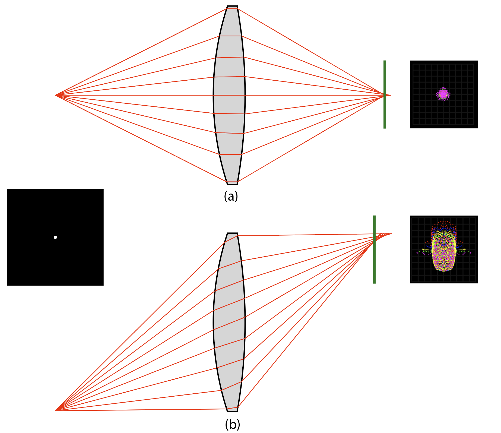
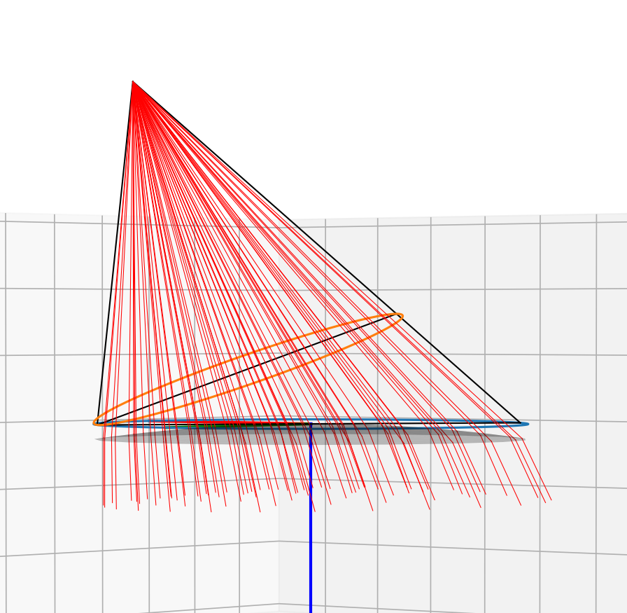
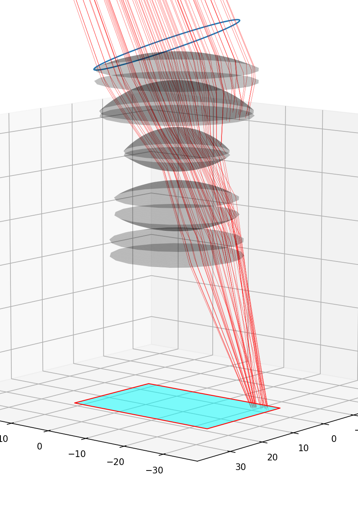
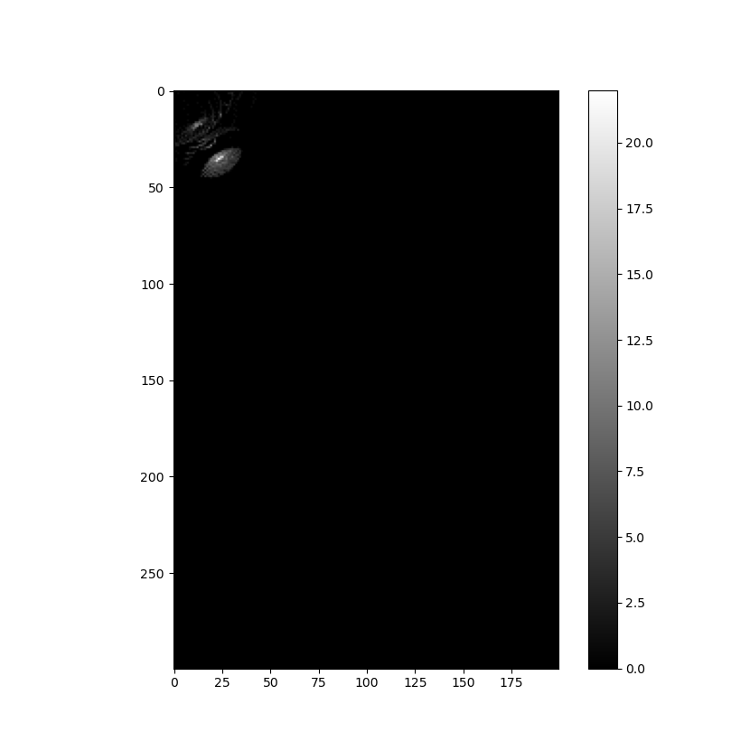

# DESIGN 6400 Journal & Documentation 

Journal for DESIGN 6400 AU24 (Prof. Maria Palazzi). 

## How to Navigate: 

- Use the table of content to quickly jump to different chapters.
- **The journal that summarizes each week's progress can be found at the end** [(**or click here**)](#journals). 
- Use `History` on top right to inspect past versions or make comparasions, there is also a `back to top` button next to it. 

The most recent updated section can be found [here](#321---object-space). Note that this is the section that received the most amount of progress with respect to the project, not the course. As such, this may not be the same as the journal content of the corresponding week. Although GitHub version history can be used to inspect past versions, for ease of access, snapshots of this documentation are also created periodically and are stored in [resources](https://github.com/Amarthgul/PersonalCodes/tree/master/OSU/DESIGN6400/resources)

#### Table of content:

- [1 - General](#1---general)
  - [1.1 - Back Focal Distance and Telecentricity](#11---back-focal-distance-and-telecentricity)
  - [1.2 - Eesurgence in Film and Vintage Lenses](#12---resurgence-in-film-and-vintage-lenses)
- [2 - Wavelength Reconstruction](#2---wavelength-reconstruction)
  - [2.1 - Selecting the Distribution](#21---selecting-the-distribution)
  - [2.2 - Dispersion](#22---dispersion)
- [3 - Ray Propagation](#3---ray-propagation)
  - [3.1 - Explore Ray Transfer Matrix](#31---explore-ray-transfer-matrix)
  - [3.2 - Sufrace Iteration](#32---sufrace-iteration)
    - [3.2.1 - Object Space](#321---object-space)
    - [3.2.2 - Object to 1st Surface](#322---object-to-1st-surface)
    - [3.2.3 - Iterate Through Surfaces](323---iterate-through-surfaces)
    - [3.2.4 - Image Plane](#324---image-plane)
  - [3.3 - Aspherical Surface](#33---aspherical-surface)
    - [3.3.1 - Even Aspheric](#331---even-aspheric)
    - [3.3.2 - Cylindrical](#332---cylindrical)
  - [3.4 - Aperture Stop](#34---aperture-stop)
- [4 - Imager](#4---imager)
  - [4.1 - Tilt and Shift](#41---tilt-and-shift)
  - [4.2 - OLPF and UVIR Cut](#42---olpf-and-uvir-cut)
  - [4.3 - Film](#43---film)
- [5 - Diffraction](#5---diffraction)
- [Journals](#journals)
- [References](#references)


------------------ 

<br />

## 1 - General 

This project aims to establish a way with which a physical lens can be digitized and used in virtual productions, such as for digital animations and TV/movies post VFX, to emulate the optical characteristics of the physical optics in a virtual setting. 

Vintage lenses are (by definition) no longer in production, there will be a day when those lenses become inaccessible for the people that wish to use them. This project thus holds a certain level of time sensitivity and will need to reach some degree of completion before vintage lenses become antique and eventually history. 

```C++
// TODO: add more explanation 
```

The logic of the application is similar to that of a ray tracer. Lights emit from a point and are collected by a lens then focused onto the image plane, in the ideal case the focused image is still an ideal point. In reality, however, this "point" is susceptible to an array of aberrations, which cause the image to become a larger spot. 

The final image of a scene can be thought as a collection of these spots added (the actual mathematical addition of values) together. Depending on how the lens produces these spots, different phenomena can be seen in the rendered image, which is the source of the “characteristic” of the lens. 

<div align="center">
	
  <p align="center">Figure 1.x. Spot of a point, this is from the sim result of Zeiss Planar 80mm f/2.8 in Zemax.</p>
</div>

In the figure above, an idealized point is placed at the left, emitting light *(this is modified for illustrational purposes, a truly ideal point has no diameter and is thus invisible to human)*. 

The lights reaching the lens are refracted and focused together after exiting the lens. However, zooming in the image may reveal that the beams are not focused together, rather, they are offset to some degree, a common sign of spherical aberration. 

An imager, shown as the dark green line in the figure, is placed right to the lens collecting the existing light. Due to the aberration, the collected image turned out to be a larger spot than the original point. 

Figure 1.x and all the subsequent figures in this document all follow the tradition of showing light paths in a lens layout graph. The left side is the `object space`, light emitted from this side of the lens. After passing through the lens, lights enter the `image space` on the right, and finally reach the imager. 

<br />

### 1.1 - Back Focal Distance and Telecentricity  

In optics, the distance between the last surface of the lens and the image plane is referred to as the `Back Focal Distance` (**BFD** for short, sometimes it is also referred to interchangeably as `Back Focal Length`). 

While BFD may seem to be a free space, in many cases it is rather constrained. For a single lens reflex (SLR) camera, the mirror is placed between the lens and the image plane, reflecting the light up into the prism and then into the viewfinder. This means the BFD must be long enough to accommodate the mirror chamber and the shutter mechanism in front of the image plane. This is the direct reason why 135 format SLRs all have a flange distance of about 40mm. 

For lens design, BFD indriectly ties in with telecentricity. Below is the layout/crossection of the lens Jupiter-12 35mm f/2.8, it has a very shoty BFD and the rays exit lens at a large angle: 

<div align="center">
	
  <p align="center">Figure 1.x. Jupiter-12 35mm f/2.8</p>
</div>

In comparison, longer BFD tend to force the exiting rays to be more telecentric, as demonstrated below: 

<div align="center">
	
  <p align="center">Figure 1.x. Canon 85mm f/1.2</p>
</div>

Note that for the Canon lens in figure 1.2, the last surface is relatively far away from the image plane (long BFD), and the exiting ray at the top have a smaller oblique angle compare to the Jupiter lens. For a pure telecentirc lens, all the exiting rays will be parallel to the optical axis. 

While high telecentricity can be very desirable for some scenarios, such as industrial applications, it also adds difficulty to lens design, especially wide angle lenses with a relatively large image circle. This makes designing wide angle lenses for SLR cameras rather difficult, designers have to resort to the inverse telephoto paradigm, straightening the existing ray for them to reach the image plane. For this reason, most wide angle lenses in the SLR era are bigger and heavier. 

In comparison, rangefinder lenses can have their elements “sink” into the camera and get really close to the image plane, such as the Jupiter-12 example in figure 1.1. More extreme examples can be seen at Zeiss Hologon 16mm f/8, which achieved 16mm wide angle with an astonishingly small body, also with highly non-telecentric design. For those lenses, even if the camera flange distance allows adaptation, the protruding rear element may also be in the way and prevents the camera from taking a picture. 

With the advancement of technology, there are less and less reasons to keep the mirror for digital cameras. Eventually the mirror was removed and digital imaging fully embraced mirrorless cameras. For mirrorless cameras, there is nothing in between the lens and the image plane (aside from some filter glasses like OLPF and UV IR cut, see [chapter 4.2](#42---olpf-and-uvir-cut)). This literated BFD in lens design, allowing lens designers to come up with optics that fully utilizes this space. 

<div align="center">
	
  <p align="center">Figure 1.x. Flange distance for different camera mounts. Showing only the main streams (there were a lot of main streams historically), some of the more proprietary and scarce mounts are omitted to save space</p>
</div>

The liberation of BFD also means that older lenses designed for rangefinder cameras, which tend to have a short BFD and consequently shorter flange distance, can now also be adapted and mounted onto mirrorless cameras. Due to the lack of mirror, even if a lens was originally designed for a system with even shorter flange distance, it can still be adapted onto new mirrorless cameras, such as putting an M42 lens onto a PL mount camera. From the technical aspect, this ensured that a vintage lens can be adapted onto almost any modern camera and is one of the driving forces for the resurgence. 

<br />

### 1.2 - Resurgence in Film and Vintage Lenses 

Placeholder 

<br />

## 2 - Wavelength Reconstruction 

For this application, a pixel on an image or a point in a 3D scene can both be viewed as a light source emiting light.  

In virtually all software the color of the pixel or the color of the point on the 3D object is expressed by RGB value (although underlaying implementations may vary). However, in reality, the color of the light is determined by the distribution and the intensity of every wavelength. This is important because refraction is dependent on wavelength, as light of different wavelength will be bent differently when entering another material with a different refraction index. 

RGB can be treated as 3 Gaussian distributions of wavelengths. With the RGB value on each channel representing the intensity of the peak wavelength, acting as a scale factor for the entire distribution. Integrating over all 3 distributions will then yield a spectral representation of the given RGB color, and the same process can be used to translate the wavelength distribution into RGB value. 

For ease of calculation, it may be fitting to choose the peak wavelength of RGB as: 

$$R = \lambda _{C} = 656.27 \mu m$$

$$G = \lambda _{d} = 587.56 \mu m$$

$$B = \lambda _{F} = 486.13 \mu m$$

These values also allows us to make comparisons with patents much easier, since most modern patents uses $n _D$ and $v _D$ to describe the optical material properties, and $v _D$ is defined using the values above: 

$$v_D = \frac{n _d - 1}{n _F - n _C}$$

Although integrating the 3 Gaussian distribution can be more accurate in calculating the color shift and tint in an optical system, it faces some challenges at the end of the system. Consider the case of an orthochromatic film:

<div align="center">
	
  <p align="center">Figure 2.x. Ilford Ortho Plus Spectral Sensitivity</p>
</div>

The image above showed the spectral sensitivity of [Ilford Ortho Plus](https://www.ilfordphoto.com/amfile/file/download/file/1948/product/1658) film. As can be seen, this type of film is sensitive to blue and green but not to red, red objects will appear black when shot on this film. 

The integrated spectral distribution will be clipped by the spectral sensitivity of the orthochromatic film, and the red side of the spectrum will become zero. However, due to the red channel is a Guassian distribution, there will still be part of the red channel that overlaps with the the green section, making reconstruction difficult. In this situation, it could be hard to find the RGB color using 3 Guassian distributions whose $\mu$ is still the same as the original. 

Another significant influencer is **Metamerism**, while two colors may be perceived the same, the actual composition of wavelengths and their intensities may be different. This is particularly true for colors that look warm due to the large overlapping wavelength for human green and red cod cells. On the flip side, blue rod cells caps at around 470 nm, making wavelengths shorter than that rather deterministic (also the reason why wavelengths at the shorter end in the CIE 1931 chart are located on a near straight line). 

When considering all these factors, Gaussian distribution may be hard to reconstruct after the initial disassembly. 

<br />

### 2.1 - Selecting the Distribution 

However, color and wavelength are related does not mean there is a causation. The current simplification of RGB from wavelength can be dated back to 1927 with the standard overserver experiment. And the modern implementation varies, with standards like Rec. 709 and Rec. 2020 etc. What was presented previously was but an extremely peripheral survey on color and wavelength, a comprehensive discussion may still feel short given a book’s length. Depending on the standard, there can be a myriad of methods in how to convert between RGB color and wavelength. 

In this project, after a lot of trial and errors, a naive way is adapted to convert RGB to wavelength and then back. This method relies on a dictionary that explicitly defines the color based on the Fraunhofer lines: 

```python
LambdaLines = {
    "i" : 365.01, 
    "h" : 404.66, 
    "g" : 435.84, 
    "F'": 479.99, 
    "F" : 486.13, 
    "e" : 546.07, 
    "d" : 587.56, 
    "D" : 589.3, 
    "C'": 643.85,
    "C" : 656.27, 
    "r" : 706.52, 
    "A'": 768.2, 
    "s" : 852.11
}
```

During RGB to wavelength conversion, each channel is mapped to a specific Fraunhofer line. For example: 

```python
{"R": "C'", "G": "e", "B":"g"}
```

The value of that channel will be the intensity/radiant flus of the corresponding wavelength. For an image with bitdepth $b=8$, this means the intensity of each channel is $\Phi _c = \frac{V _c}{V _{max}}$, where $V _c$ is the value of the channel, and $V _{max} = 2 ^ b$. 

As an example, using the RGB definiton above, an 8-bit pixel of value $\left(  255, \\ 0, \\ 0 \right)$ will be converted as 3 different wavelengths $\left( 643.85, \\ 546.07, \\ 435.84 \right)$, with each wavelength carrying and intensity/radiant flux of $\left(  1.0, \\ 0, \\ 0 \right)$.

This apparently will have some accuracy issues, sampling only 3 wavelengths may not be enough. 

To solve this, an apparent solution is to introduce a secondary spectrum. The member of this secondary spectrum can be expressed either using the Fraunhofer symbols listed above, or explicitly stated wavelengths (in nanometers). The program will interpolate the wavelength based on its linear distance from the Fraunhofer lines for RGB designated in the last step and yield corresponding radiant values.Of course, it might happen that the user input wavelength is away from the RGB and into the UV/IR range. For this, an UV-IR cut is implemented that essentially acts as the zero value bound. If the secondary spectrum wavelengths are beyond the UV/IR cut then the radiant will return 0, otherwise a similar linear interpolation is used to determine the radiant. 

However, in practice, the secondary spectrum described above will have some problems. Still consider, for the moment, the pixel of color `[255, 0, 0]` used above. With the secondary spectrum, the translated wavelength collection will be `[643.85, 546.07, 435.84, 486.13, 589.3 ]`, with radiant `[1, 0, 0 , 0, 0.44211495]`. But when the same process is used to convert this wavelength back to color, it will result in `[255, 100,  0]`. The green channel is now non-zero, which is caused by the `589.3nm` wavelength being decomposed into both red and green color, but this wavelength is only created by interpolating from the `643.85nm`. 


```C++
// TODO: add equations for linear disassembly based on distance 
```

### 2.2 - Dispersion 

One of the most important aspect of determining the wavelength is to use it in calculating the refraction index of this wavelength in a certain material, different wavelenth will have different refraction index in the same material, i.e., dispersion. 

The dispersion characteristic of a material can be described using several different formulas listed below (listing only the common ones): 

- **Schott** 

$$n ^2 = a _0 + a _1 \lambda ^ 2 + a _2 \lambda ^ {-2} + a _3 \lambda ^ {-4} + a _4 \lambda ^ {-6} + a _5 \lambda ^ {-8}$$

This is probably one of the most commonly used optical materials. 

- **Sellmeier 1** 

$$n ^2 - 1 = \frac{K _1 \lambda ^2}{\lambda ^2 - L _1} + \frac{K _2 \lambda ^2}{\lambda ^2 - L _2} + \frac{K _3 \lambda ^2}{\lambda ^2 - L _3}$$

For describing optical materials, Sellmeier 1 can be seen as often as Schott. 

- **Sellmeier 3** 

$$n ^2 - 1 = \frac{K _1 \lambda ^2}{\lambda ^2 - L _1} + \frac{K _2 \lambda ^2}{\lambda ^2 - L _2} + \frac{K _3 \lambda ^2}{\lambda ^2 - L _3} + \frac{K _4 \lambda ^2}{\lambda ^2 - L _4}$$

Very few optical glasses uses Sellmeier 3 to describe their dispersion characteristics, and for the ones that do use them, they're typically materials for optical systems designed for UV range. 

- **Sellmeier 4** 

$$n ^2 = A + \frac{B \lambda ^2}{\lambda ^2 - C} + \frac{D \lambda ^2}{\lambda ^2 - E}$$

Sellmeier 4 has been used primarily in birefringent materials. Since polarization is less disscussed here in this applciation, Sellmeier 4 will also receive less attention. 

- **Herzberger**

$$n=A + BL + CL ^2 + D \lambda ^2 + E \lambda ^4 + F \lambda ^6$$

$$L = \frac{1}{\lambda ^2 - 0.028}$$

Herzberger formula is quite similar to Sellmeier 3, the difference is that Herzberger formula is used more in materials for optical systems in IR range.  

- **Conrady**

$$n=n _0 + \frac{A}{\lambda} + \frac{B}{\lambda ^ {3.5}}$$

- **Extended 2**

$$n ^2 = a _0 + a_1 \lambda ^2  + a_2 \lambda ^{-2} + a_3 \lambda ^ {-4} + a_5 \lambda ^{-8} + a_6 \lambda ^4 + a_1 \lambda ^2 + a_7 \lambda ^6$$

- **Extended 3**

$$n ^2 = a _0 + a_1 \lambda ^2  + a_2 \lambda ^{4} + a_3 \lambda ^ {-2} + a_5 \lambda ^{-4} + a_6 \lambda ^{-6} + a_1 \lambda ^{-8} + a_7 \lambda ^{-10} + a _8 \lambda ^{-12}$$


<br />

## 3 - Ray Propagation 

With the color of the ray fixed, the refraction index will also become determinsitic. Now it is possible to propagate rays through different surfaces. 

### 3.1 - Explore Ray Transfer Matrix

In geometric optics, a ray can be described by:

$$\binom{h_2}{\gamma _2}$$

$h_2$ is the height of the light (from the optical axis), and $\gamma _2$ its angle. As such, the ray propagatiion can be expressed as a matrix operation: 

$$\binom{h_2}{\gamma _2}=\begin{bmatrix}
 \mathbb{A}& \mathbb{B} \\
\mathbb{C} & \mathbb{D} \\
\end{bmatrix}\cdot \binom{h_1}{\gamma _1}$$

Where the different components of the matrix can be configured differently to represent translation and refraction. This is very similar to 2D transformation matrix, the only difference is that $\gamma$ represents the radian and thus the "rotation" is based on the Snell's law, as defnied by: 

$$n_1 \sin \theta _1 = n_2 \sin \theta _2$$

Typically, the translation matrix will be denoted as $\mathbf{T}$ and refration matrix as $\mathbf{R}$. Under the paraxial assumption, it can be derived that: 

$$\mathbf{T}=\begin{bmatrix}
1 & -l \\
0 & 1 \\
\end{bmatrix}$$

$$\mathbf{R}=\begin{bmatrix}
1 & 0 \\
\frac{n_2 - n_1}{n_2 \cdot r} & \frac{n_1}{n_2} \\
\end{bmatrix}$$

Where $l$ is the traveled length, $r$ is the surface radius, $n_1$ and $n_2$ are the RI of each medium. 
Then, a ray going through a lens can be represented as: 

$$\binom{h_3}{\gamma _3}= \mathbf{M} _L \binom{h_1}{\gamma _1} \quad with \quad \mathbf{M} _L= \mathbf{R} _2 \mathbf{T} _{12} \mathbf{R} _1$$

The translation and refraction matrix can then be pre-multiplied and thus represent the lens with one single matrix. For a lens with multiple elements, this process is still applicable, allowing the ray transfer to be condensed into simple matrix multiplications. 

This approach, however, does not fit here. On one hand, the ray transfer matrix is established under paraxial approximation, which assumes the oblique angle of the incident light $\theta$ to be small enough that it equals $\sin \theta$. On the other hand, the ray transfer applies only on a 2D plane or an axisymmetric lens, which is not the case here. Additionally, the ray transfer matrix is also sequential, as it ignores reflection at each surface and the scattering during ray propagation. 

For this application, the lens can be non-axisymmetric due to the inclusion of cylindrical and conical elements. And to emulate veiling glares and some types of flares, reflection also needs to be modeled, which makes this process non-sequential. To put it simply, it is closer to a 3D ray tracer application. 

For 3D, representing an angle in degrees or radians can be difficult, as Euler angles are susceptible to gimbal lock. Quaternions are free from these sufferings but are rather questionable to be used to calculate reflections and refractions, due to the need of being translated into Euler angle, perform reflection and refractions, then translate back to quaternions again. 

One way to work around that might be to use vectors to represent the ray direction, this also avoids the gimbal lock and rotation hierarchy problem. With 3D vectors, it can be proved that when the incident vector $\mathbf{I}$ in a medium with RI $n_1$ enters a different medium with RI $n_2$, given the normal at the point of incident to be $\mathbf{N}$, then the refracted vector $\mathbf{R}$ can be expressed as:  

$$ \mathbf{R}=\frac{n_1}{n_2}\left ( \mathbf{I} - \left ( \mathbf{I} \cdot \mathbf{N} \right ) \mathbf{N} \right ) - \mathbf{N} \sqrt{ 1 - \left ( \frac{n_1}{n_2} \right ) ^{2} \left ( 1 -  \left( \mathbf{I} \cdot \mathbf{N} \right )^{2} \right ) }$$

To use these vector equations in the same way as the ray transfer matrix, there need to be a matrix $\mathbf{M}$ such that: 

$$\mathbf{R} = \mathbf{M} \cdot \mathbf{I}$$

Take the refraction equation as an example. Use $$\sigma = \frac{n_ 1}{n_ 2}$$ to substitute the corresponding terms, and disassemble the vectors as:

$$\mathbf{R} = \begin{pmatrix} 
R_x \\
R_y \\   
R_z \\
\end{pmatrix}$$

$$\mathbf{N} = \begin{pmatrix} 
N_x \\
N_y \\   
N_z \\
\end{pmatrix}$$

$$\mathbf{I} = \begin{pmatrix} 
I_x \\
I_y \\   
I_z \\
\end{pmatrix}$$

The vector refraction formula can then be written as: 

$$\mathbf{R} = \begin{pmatrix}  
R_x \\ 
R_y \\  
R_z \\
\end{pmatrix}=\begin{pmatrix}  
I_x \left( \sigma - \sigma N_x^2\right) - I_y \left( \sigma N_y N_x \right) - I_z \left( \sigma N_z N_x \right) \\ 
I_y \left( \sigma N_x N_y \right) - I_y \left( \sigma - \sigma N_y^2 \right) - I_z \left( \sigma N_z N_y \right) \\  
I_z \left( \sigma N_x N_z \right) - I_y \left( \sigma N_y N_z \right) - I_z \left( \sigma - \sigma N_Z^2 \right) \\
\end{pmatrix} - \begin{pmatrix} 
N_x \\
N_y \\   
N_z \\
\end{pmatrix} S
$$

Where $S$ is a scalar defined by $\mathbf{I}$ and $\mathbf{N}$:

$$S = \sqrt{ 1 - \sigma^2 + \sigma^2 I_x^2 N_x^2 + \sigma^2 I_y^2 N_y^2 + \sigma^2 I_z^2 N_z^2 + 2 \sigma ^2 I_x I_y N_x N_y + 2 \sigma ^2 I_x I_y N_x N_y +2 \sigma ^2 I_z I_x N_z N_x }$$

This turned out to be troublesome, terms like $\sigma ^2 I_x I_y N_x N_y$ makes it very hard to rearrange $S$ such that there exists a matrix $M$ that satisfies $\mathbf{R} = \mathbf{M} \cdot \mathbf{I}$ (While Taylor Expansion may help with this situation, it will add significantly more work here and consequently further slowing down the development).  This also indicates that the different terms in the incident vector in 3D are not independent from each other upon refraction, which makes sense. To summarize, **in a 3D setting without the paraxial approximation, the ray transfer matrix may not work**. 

Luckily, this is not the end of the story. Not being able to obtain a matrix multiplication form of refraction simply means that the program may have to iterate through every surface instead of aggregate all the surfaces together, it will take more time, but still doable. 

<br />

### 3.2 - Sufrace Iteration 

Before feeding a ray into the lens, the surfaces must be defined. A typical spherical surface in this application has 4 attributes:

- **Radius** $r$. The surface curvature. 

- **Material**. A material attribute is used instead of $n_D$ and $v_D$ since refraction and reflectance vary by wavelength, using material could ensure that refractive index can be freely calculated depending on the wavelength. This attribute is presented in the form of a `string` like `LASFN1`, a look-up table is used to retrive the parameters of the material. 

- **Clear semi-diameter** $s _d$. The name “semi-diameter” is borrowed from Zemax and similar optical design software, it essentially describes the working radius of the surface, calculated by height from the optical axis. Radius larger than that will be treated as a flat plane perpendicular to the axis. This value is non-negative, and for a lens group with 2 or more surfaces (such as a doublet), the clear semi-diameter of the first surface will be used for the rest of surfaces as well. 

- **Edge chamfer** $c$. At the edge of the clear semi-diameter, a 45 degree chamfer can be applied. The positive chamfer value points to the positive $z$ direction, which means this value should be either 0 or having the opposite sign of $r$.  For a lens group with 2 or more surfaces, only the first and last sufrace's chamfer will be calculated. 

<div align="center">
	
  <p align="center">Figure 3.1. Notations for surfaces, negative values are noted in red.</p>
</div>

Aside from the chamfer, the rest are the same as most optical simulation software, like Zemax and CODEX. 

It is also worth noting that here we defined the origin to be the vertex of the first surface. The coordinate system is a right hand system with the positive $y$ axis pointing up, The $z$ axis is the optical axis for the lens and its positive direction points to the direction of the image plane, as shown in the figure below. This also gives us the convenience that the entire $z<0$ area is the object space, and that the image space will only exist in $z>0$. 


<div align="center">
	
  <p align="center">Figure 3.2. The coordinate system used.</p>
</div>

Readers may notice this coordinate seems to contradict the surface radius direction. The sign of the surface radius is set to conform to the lens design tradition, with positive being convex and negative being concave when viewing from the front. 

<br />

#### 3.2.1 - Object Space 

For a real lens, its object space is the real world. In this application, however, object space may be in several different forms. 

The simplest case is a **point source**. This can be defined as a point residing in the position $\mathbf{P}=\left ( x, y, z \right )^{T}$ emitting light of a certain wavelength(s) $\lambda$, with radiant flux $\Phi$. 

For optical imaging, the position of the source can also be represented as a field angle instead of a 3D position, basically using the polar coordinate instead of the Euclidean one. 

<div align="center">
	
  <p align="center">Figure 3.3. The point source.</p>
</div>

As figure 3.3 illustrated, the point can be represented using 2 field angles $\theta_{x}$ and $\theta_{y}$, plus a distance $d$. This is particularly useful since the angle of view of lenses is easier to test using field angle than Euclidean positions. However, it is worth noting that in the actual computation, the polar coordinates will still be converted to Euclidean positions, the polar form is just for ease of use, similar to the relationship between HSV and RGB color space. 

For wavelengths, due to modern computer graphics and animation software uses almost exclusively RGB, the wavelength representation should better be regarded as an intermediate. As such, in this program, the color of the light from the point source shall be represented as RGB values. The RGB is either `[0, 1]` or a discrete range depending on bit depth, `[0, 255]` for `8` bits.

Note that a point source may also be expanded as the return value of a ray cast from a ray tracing renderer. 

Another case of an object that shall be used here is a 2D image. The image can essentially be viewed as a collection of points, propagating every one of these points through the system and integral the result will then yield the image as if shot through the lens. However, an image will introduce more variables than a single point, and they must be defined to convert the image into a grid of points. 

Assuming the image is a single image in typical 8 bit RGB format (that is, without channels for z-depth etc.). Then the $z$ distance of all the points will be the same, it is only the $x$ and $y$ position that will vary. Due to the image itself being a discrete sample of colors (as pixels), the pixel density (i.e., resolution) difference between the image and the imager may introduce mosaic pattern. 

While an adaptive sampling may be implemented to cover the minimum amount needed to create a smooth image, it may cause burden on the hardware and may not be deemed as controllable as some users want, a manual definition is thus more ideal. The image thus has 2 set of parameters:

- **Dimension**

  The physical size of the image in the object space, like `300mm x 200mm`. 

- **Sample per millimeter**.

  As the name indicates, how many samples to have per millimeter, denoted as $s$. Note this is a scalar parameter, and for an image area in $1mm^2$, the actual samples will be $s^2$. 

In practice, the dimension will be timed with a sample per millimeter to get the sample count on each axis. The image will then be resized to that size, then each pixel on the resized image will be treated as a sample. This also allows the space sample algorithm to be converted into image resolution resampling algorithm 


<br />

#### 3.2.2 - Object to 1st Surface 

For an object point $P$ not located at infinity, ignoring indirect reflections for now, all the light reflected from this point that can be gathered by the lens forms a cone. If the object point is not directly on the optical axis, then this cone becomes an oblique cone. 

The next task is to sample the lights in this oblique cone evenly. The most obvious way may be to subdivide the circle formed by the clear semi-diameter $d$, which will work, **if only** the first surface is prefectly flat. However, for almost all photographic lenses, the first surface is not flat (barely any surface in a lens is flat). This creates a probelm, when the surface curvature is significant and the incident angle is large enough, even sampling based directly on clear semi-diameter will create unevenness from the perspective of the point.

<div align="center">
	
  <p align="center">Figure 3.4. Unevenness caused by surface curvature.</p>
</div>

As shown in the figure above, there is an observable amount of spatial density unevenness of the rays emitted from the point, the upper part appears to be denser than the lower part. In another words, the point "emits" more light from the top than from the bottom. While this kind of emission/distribution may be true for some highly reflective sufraces at certain angle, it is not valid for Lambertian surfaces, which is very much the case here.   

A better way is to sample from the projection of $d$ from the direction of the object point $P$. 

<div align="center">
	
  <p align="center">Figure 3.5. Cross section of an oblique cone.</p>
</div>

The figure above shows the cross section of the oblique cone on the plane that contains its apex, our goal is to obtain the ellipsal shape on the plane of $AB$ perpendicular to $PCA$. 

To make it clearer, below is the figure presented in a more 3D enviroment: 

<div align="center">
	
  <p align="center">Figure 3.6. The cone in 3D.</p>
</div>

Note that the figure above represents a surface with $r=\infty$, i.e., a plane. Since the first vertex is the origin, the location of the circle on $z$ axis will be offset a bit depending on the radius and clear semi-diameter. 

Let the location of the point $P$ to be:

$$p _P = \left( p_x, p_y, p_z \right) ^ T$$

Then, the position of point $A$ and $C$ can be accquired by timing the clear semi-diamater $d$ with the normalized $xy$ directional vector. There $z$ coordinate can be accquired by using Pythagorean theorem using radius and clear semi diameter: 

$$p _A = d \frac{\left( p_x, p_y, 0 \right) ^ T}{\left|  \left( p_x, p_y, 0 \right) ^ T \right|} =
\begin{pmatrix} 
d p_x / \sqrt{p_x ^ 2 + p_y ^ 2} \\ 
d p_y / \sqrt{p_x ^ 2 + p_y ^ 2} \\
r - \sqrt{r ^2 - s _d ^2} \\
\end{pmatrix}$$

and:

$$p _C = d \frac{\left( -p_x, -p_y, 0 \right) ^ T}{\left|  \left( -p_x, -p_y, 0 \right) ^ T \right|} =
\begin{pmatrix} 
-d p_x / \sqrt{p_x ^ 2 + p_y ^ 2} \\ 
-d p_y / \sqrt{p_x ^ 2 + p_y ^ 2} \\
r - \sqrt{r ^2 - s _d ^2} \\
\end{pmatrix}$$

This makes it possible to calculate $\vec{PA}$ and $\vec{PC}$. Let $\mathbf{\hat{a}}$ and $\mathbf{\hat{c}}$ to denote the normalized $\vec{PA}$ and $\vec{PC}$, then the direction of vector $\vec{PD}$ can be accquired by simply averging them: 

$$\vec{n} = \frac{ \mathbf{\hat{a}} + \mathbf{\hat{c}} }{2}=\begin{pmatrix} 
n_x \\ 
n_y \\
n_z \\
\end{pmatrix}$$

Note that $\vec{n}$ is also the normal vector the the projected conical area we are trying to get. This gave us:

- The normal $\vec{n}$ of the plane.
- A point $A$ on the plane.
- The direction $\vec{PC}$ of the line.
- A point $C$ on the line.

With these info, it is then possible to calculate the position of point $B$:

$$p _B = p _C + \vec{CP} * t$$ 

$$t = \frac{ \vec{n} \cdot \left(p _A - p _C \right) }{ \vec{n} \cdot \vec{CP} }$$

The position of point $B$ then allows us to derive the equation for the eclipse perpendicular to plane $PAC$ and passing through $AB$, illustrated in the figure below as the pink ellipse: 

<div align="center">
	
  <p align="center">Figure 3.7. Conical section. </p>
</div>

As a 2D shape, the ellipse can be described as: 

$$\frac{x ^ 2}{a ^ 2} + \frac{y ^ 2}{b ^ 2} = 1$$

Where [^1]: 

$$a = \frac{AB}{2}$$

$$b = \frac{ \sqrt{B B\' \cdot AC} }{ 2 }$$

Apparently, $AB$ can be accquired by subtracting the postion of the two points, and $BB\'$ can be calculated by exploiting the similarity between $PBB\'$ and $PCA$, it is also quite convenient since $AC$ is the clear diameter, i.e., $AC = 2d$. 

There is still work to be done, the ellipse equation described above is 2D (or, in the 2D $xy$ plane), but the ellipse in question resides in a true 3D space. This can be solved by simple 3D transformations. First, totate the ellipse to the right direction so that its semi-major axis align with the $AB$ line, the rotation angle can be easily determined by using the projection of point $P$. Next, move the ellipse so that it touches point $A$. At last, rotate the ellipse around point $A$ by the angle between $AB$ and $AC$. Since these are all general 3D transformation, the process ~~shall be left as a practice for the reader~~ is omitted here. 

Next step is to sample this ellipse. The most intuitive way is to use a random distribution, but this would require a fairly high sample count in order to look more even. To achieve even sampling with small sample count, an area-based sampling is adopted. 

First, determine how many rings will be used in the sample, each ring is a concentric ellipse on which sample point will be placed. Then, the unit radius is divided by the number of rings to acquire each step length. Starting from the innermost ring ($step lenth = 1$), calculate the increment in area (the delta area). Divide this delta area with a constant to get the number of sample points on this ring, and use polar coordinates to locate these sample points. Those sample points can then be transform in the same way as the ellipse to accuquire the ray points. 

```C++
// TODO: add handling for when the surface radius is large enought to cause occlusion. Find a way to factor in the 2 different axis lenth of the ellipse. Note that the current sampling method essentially works the same as the paraxial assumption, just more accurate in the angles. 
```

With the sample points, we can then cast vectors  from point P to them and generate a bunch of rays. The next step would be determining where they ray intersects with the lens surfaces. 

<br />

#### 3.2.3 - Iterate Through Surfaces

A typical sphere in 3D is expressed as:

$$\left( x - x _c \right) ^2 + \left( y - y _c \right) ^2 + \left( z - z _c \right) ^2 = r ^2$$

In last chapter, we calculated the position of the sample points on the ellipse, which enables us to derive the vectors. Let us say there is a ray emitting from $\mathbf{p _P} = \left( x _0, y _0, z _0 \right) ^ T$, at the direction $\mathbf{v} = \left( x _v, y _v, z _v  \right) ^ T$, it can be shown that the parametric form of the intersection equation is:

$$A t ^2 + B t + C = 0$$

Where: 

- $$A = v _x ^2 + v _y ^2 + v _z ^2 $$
- $$B = 2 \left( \left( x _0 - x_c  \right) v _x + \left( y _0 - y _c  \right) v _y + \left( z _0 - z _c  \right) v _z \right)  $$
- $$C = \left( x _0 - x_c  \right) ^2 + \left( y _0 - y _c  \right) ^2 + \left( z _0 - z _c  \right) ^2 $$

It is then possible to calculate: 

$$t = \frac{ -B \pm \sqrt{ B ^2 - 4 AC } }{ 2A }$$

And accquire the intersection point with: 

$$\begin{pmatrix} 
x \\ 
y \\
z \\
\end{pmatrix} = \begin{pmatrix} 
x _0 + t v _x \\ 
y _0 + t v _y \\
z _0 + t v _z\\
\end{pmatrix}$$

Note that depending on the direction of the vector and the point it originated from, there can be three cases of intersection: 

- No intersection. When the distance between the line (formed by the vector and the point) to the sphere’s center is bigger than the radius.  
- 1 intersection. When the line is in tangent with the sphere. 
- 2 intersections. When the distance is smaller than the radius. 

A spherical surface, however, requires some modifications. For one, a surface is only 1 side of the sphere, the 2 intersections scenario needs to be modified to only have 1 intersection. This can be done by simply looking at the sign of the surface radius. 

After that, the refraction can be calculated by the vector refraction formula: 

$$ \mathbf{R}=\frac{n_1}{n_2}\left ( \mathbf{I} - \left ( \mathbf{I} \cdot \mathbf{N} \right ) \mathbf{N} \right ) - \mathbf{N} \sqrt{ 1 - \left ( \frac{n_1}{n_2} \right ) ^{2} \left ( 1 -  \left( \mathbf{I} \cdot \mathbf{N} \right )^{2} \right ) }$$

In a similar way, the reflection vector can be defined as: 

$$\mathbf{R}=\mathbf{I}-2 \left ( \mathbf{I} \cdot \mathbf{N} \right ) \mathbf{N}$$

Note that the reflection does not involve refractive index at this point, polarization is also not considered due to the simple geometric optics assumptions. 

<br />

#### 3.2.4 - Image Plane 

While the image plane can be viewed as a mere spherical surface with infinity radius, the calculation method may vary. For simplicity, a flat image plane can be viewed as a 3D plane. And assume there is no tilt shift happening (which will be addressed later), the plane can be expressed as simple as:

$$z=z_0$$

As such, the intersection between the image plane and the rays can be easily calculated by substituting the z value. 

But to acquire an image, much more work is needed. 

First, the data structure will need to be modified. The data propagated through the surfaces need to be augmented to contain information. We may design it as: 

$$\mathbf{r}=\left(  x,\\ y, \\ z, \\ v _x, \\ v _y, \\ v _z, \\ \lambda, \\ \Phi, \\ i, \\ b _s \right) ^T$$

In those components: 

- $x$, $y$, and $z$ are the location of the base point of rays, typically their position on a surface. $v _x$, $v _y$ and $v _z$ are the vector directions. These 2 sets of parameters can be used to express the position and direction of rays. 
- $\lambda$ is the wavelength, which is used to calculate the refraction index.
- $\Phi$ can be treated as the radiant, i.e., the number of photons per unit time. But it can also be viewed as a normal unitless scalar representing the intensity of the the ray at the given wavelength. 
- $i$ is an index denoting which surface this ray is currently in. It means the ray is currently behind a certain surface but not into the next surface.This can help determining the relative location of the ray more easily then using the position and direction. 
- $b _s$ is boolean variable, with `True` meaning the given ray is propogating sequentially, and `False` meaning the ray is no longer treavling sequentially, i.e., reflected or vignetted. This can be helpful making the lens more art directable by isolating the propogation type. 

The first 6 terms are the ones used previously when discussing the propagation of rays, and they can be easily adapted into the new system. The later terms are for image formation and to provide more control over the selection of rays. 

With the radiant term, it is then possible to calculate the image formed after the rays arrives at the image plane by taking an integral (discrete integral, since the rays are rather sparse) over the image plane. 

There is, however, one trivia. The pixels on an image are indexed as unitless integers, but the location of the rays on the image plane are decimal numbers representing physical measurements. While the rays can be iterated through one by one and determine its corresponding pixel location, this process is not going to be efficient at all as the time complexity is going to be $\theta \left( n \right)$ where $n$ is the number of rays. A different approach can be adapted here to do the same but with constant time complexity. 

Assume the positions of the intersection is represented as a 2D array $\mathbf{p} = \left( \mathbf{p_x}, \mathbf{p_y}, \mathbf{\Phi} \right) ^T$, the process is as follows: 

- Determine the pixel pitch of the imager by dividing its physical size by the number of pixels on the axis, this results in a $\mu = \frac{L}{p_L} < 1$ for virtually all digital sensors.
- Divide the intersection points' position by the pixel pitch and accquire the scaled up intersection locations.
- Offset the intersection points' position by half of the pixel count on each axis. For example, if the imager has a dimension of `960 x 540`, then offset the positions by `(480, 270)`.
- Floor cast the positions from decimal to integer.

Now, the position of the ray intersections directly represents the index of the pixel it falls into, an iterative look-up operation is thus converted to a simple hashing. 

<br />

### 3.3 - Aspherical Surface 

Placeholder 

<br />

#### 3.3.1 - Even Aspheric 

Standard ASPH elements, which can be seen as early as the FD 55mm f/1.2 Asph. 

<br />

#### 3.3.2 - Cylindrical 

For anamorphic lenses. 

<br />

### 3.4 - Aperture Stop 

Placeholder 

<br />

## 4 - Imager

In [chapter 3.2.3](#323---image-plane) it is already discussed how to intersect a simple imager with rays, this chapter will focus on the more complex effects of the imager, such as tilt shift, halation, and spectral response. 

<br />

### 4.1 - Tilt and Shift

Aside from simple 3D transformation, a big effect tilt-shift has is the potential of color shift for digital sensors. This is caused by the depth of the photosite well and the microlens in front of it, which will be the focus here in this chapter. 

<br />

### 4.2 - OLPF and UVIR Cut 

Placeholder 

<br />

### 4.3 - Film

Placeholder 

<br />

## 5 - Diffraction 

Up till this point, the project has been operating under the realm of geometric optics, i.e., treating lights as beams and particles. However, geometric optics cannot replicate one of the most famous optical artifacts used in movies, TVs, and video games: **flares**. 

<br />

## Journals

Parenthesis marks the Monday of that week for easier identification. 

- [Week 1 (Aug 19th)](#week-1)
- [Week 2 (Aug 26th)](#week-2)
- [Week 3 (Sept 1st)](#week-3)
- [Week 4 (Sept 8th)](#week-4)
- [Week 5 (Sept 15th)](#week-5)
- [Week 6 (Sept 22nd)](#week-6)
- [Week 7 (Sept 29th)](#week-7)
- [Week 8 (Oct 6th)](#week-8)
- [Week 9 (Oct 13th)](#week-9)
- [Week 10 (Oct 20th)](#week-10)
- [Week 11 (Oct 27th)](#week-11)
- [Week 12 (Nov 3rd)](#week-12)


### Week 1

(Week of Aug 19th)

This week was mostly spent on setting up this markdown document and some initialization work for the course. The table of content was drafted according to my estimation and will hopefully provide a directional guide in the rest of the semester. In this documentation I have been working on the first several chapters, particularly the first introductory chapter, preparing it for the next research proposal assignment.  

For now, I intend to spend the first 5 weeks on the math part, establishing a theoretical foundation for the later implementation (paper prototype, one can say). Although some degree of implementation may be attempted. 

-> Back to [journal selection](#journals)

<br />


### Week 2

(Week of Aug 26th)

Attempting to disassemble the ray transfer matrix in 3D revealed that this approach may not work, documented in chapter [3.1](#31---explore-ray-transfer-matrix). I then switched to using the more traditional ray casting approach, treating rays as vectors in 3D. 

While I initially thought the difficulty would only come when I try to recursively propagate the lights through the lens, it ended up arriving much earlier. It appears that directly sampling from the clear diameter $d$ will result in unevenness around the edges (illustrated by figure 3.3). To avoid that, the sample should be based on an ellipse in the plane perpendicular to the incident angle. 

The road to get that ellipse was quite difficult. I tried to do it step by step, first calculating the plane normal, then finding the plane equation, followed by finding the 2 coefficients for the ellipse. I also tried to use the different terms of the vectors to derive a direct expression of the ellipse, but it quickly got out of hand and out of page as well, some of the incredibly cumbersome equations can still be found in the snapshots. Later it occurred to me that with plane normal, line direction, a point on the line and a point on the plane, I could directly calculate the intersection and use triangle similarity to find the ellipse. Which finally ended my struggles that lasted for over over 2 days. 

This also led me to think: for me and for this project, the final implementation will be done by Python Numpy, which is fairly fast for matrix and array calculation. While it certainly will be good if I can simplify the calculations by disassembling a matrix element by element then eliminating certain terms, the time saved from using these simplified calculations may not be fully justified by the sheer amount of time spent to derive them. 

Anyways, finding the formula for the ellipse enabled me to proceed to try sampling on this ellipse. Somehow I found no established algorithm on this subject, but some people online mentioned to use area increment to decide how many sample points to put into a certain area. Eventually I derived a layered-based sample method and was able to produce a fairly even sampling, as shown in the figure below: 

<div align="center">
	
  <p align="center">Journal Figure 2.1. Demo calculation result showing sampling points on a 3D ellipse. The red, green, and blue line shows the $x$, $y$, and $a$ axis, pointing to their positive direction respectively. </p>
</div>

There was also a lot of time spent on adding more content on this document, particularly the first chapter. Writing those non-technical stuff ended up feeling more difficult than the technical ones, subjective narratives seem to require way more organization than objective inductions. 

And a slight tangent: I finally understand why some people prefer to do the calculations on a bigger surface like a whiteboard or a blackboard. The formulas I wrote on paper are barely recognizable and they get increasingly bad with more time spent on them. Whiteboards, on the other hand, have some magic that can sustain a long period of thinking and writing without significant deterioration of handwriting. I assume this is due to the bigger surface area uses more elbow movement than finger, which is easier to control for a long time. 

In general, the planned goal for this week was to find a first surface sampling algorithm, i.e.,  solving the question of **how to evenly poject the light reflected from a point in space onto the first surface of the lens?** Given the results(as described in chapter [3.2.1](#321---object-to-1st-surface)), I'd say this goal is accomplished. 

During the process I did realize that there are possible drawbacks for the current methodology, like it cannot generate a correct and even sampling when the incident angle is too steep, and if the curvature of the first surface is too big, this method also cannot account for the surface occlusion. But since the entire process is designed to be modular, I can come back and modify them later. The current priority should be to keep moving forward and have a working prototype as soon as possible. 

-> Back to [journal selection](#journals)

<br />


### Week 3

The goal of this week is to find a way to propagate rays from one surface to another. And since it is the only refractive model in geometrical optics I’m considering, the derivation process turned out to be very easy, as described in section [3.1](#31---explore-ray-transfer-matrix). This week I managed to finish a spherical surface defnition that could calculate the effective zone of the sperical surface (since for a lens, its surface is only part of a sphere, not the entire sphere) and use it to calculate the intersections. 

There are several things I came to realize this week: 

- There need to be a lens class (and a surface sub-class) so that rays propagating through can make inquiry of the lens at any time.
- The reflective index of the given wavelength needs to be caulcated by material properties, this turned out to be a bit cumbersome to do. For example, the	BK7HT glass from Schott is described using the Sellmeier equation in its datasheet. In order to find the refractive index of a given wavelength in this glass, I would need to have a database that records the paramters for BK7HT's Sellmeier coefficients and use it to calculate the refractive index.
- While mathematically the calculator of the sample points may be correct, they don’t stay this way in the programming side. Due to rounding errors, things that are on edge may end up getting pruned or become ineffective. An additional tolerance need to be implemented to make it also work in the code. 

I also decided to move some of the testing codes into a new project and no longer rely on the Google Colab. This way I no longer need to cramp all the codes in one file and can now referencing them freely. 

<div align="center">
	
  <p align="center">Journal Figure 3.1. The sample points converted to vectors and projected onto the spherical surface. </p>
</div>

In general, this week received fewer visible updates than I would liked to, but I think the overall progression is still on par. 

Some other not so directly related findings include that GitHub markdown seems to not support tagging, so I cannot put an index for the equations. This is mildly troublesome since I cannot refer to a specific formula by saying something like “substitute the terms using equation 3.22, we can get…”, it also makes locating the equations a bit tricky. 

-> Back to [journal selection](#journals)

<br />

### Week 4

The semester plan was to use the first 5 weeks on pure theoritical algorithms, only then start the programming implementation. However, just as a mean of validation, I tried to write a Python method of every algorithm written in the main article, somehow they worked togther, hence the demo images in previous weeks' journals. And it is because of the coding part that I realized the current algorithm does not address certain problems, primarily Total Interanl Reflection and Vignette. 

In section [3.1](#31---explore-ray-transfer-matrix) I have noted that ray transfer matrix seems to be a dead end for more accurate simulations. What I did not say is that for most programming languages, array operations typically have faster support than the same elements in the array but are iterated one by one. For this reason, the data structure in these algorithms should still better be designed in a form that can be written as array operations. But since this is technically a programming language dependent concern, I have not explicitly written this into the documentation. 

<div align="center">
	
  <p align="center">Journal Figure 4.1. Monochromatic rays passing through a single lens with RI 1.5 and converging behind. </p>
</div>

Now that I can achieve ray propagation to some degree (as shown in the figure above), I realized something else. It is quite easy for rays to be vignetted or experience total internal reflection. In these two cases, the rays will then be unable to directly travel to the next surface, thus becoming non-sequential. 

(reminder that sequential means the ray will travel from one surface to the next and never returns)

Mathematically non-sequential rays are not a problem, but coding-wise they are. Because these non-sequential rays were once sequential and were in the same array. It is very tricky to handle 2 different types of rays in 1 array. As such, I decided I need a new data structure to perform the calculation. The new structure is described at the beginning of section [3.2.3](#323---image-plane) and is still work in progress. 

This could be my advantage in designing stuff, at the same my Hamartia. I don’t believe I am physically capable of thinking of a thing without considering its tangents and contexts. I cannot evaluate an idea purely for the idea's sake, its origin, its cause, its implications and implementation (even non-existence at the time) will all be considered. In other words, my way of working tends to contain feedback from outside of the current time and scope. 

Just in this project and just so far, this habit has saved me from committing several mistakes and have corrected several oversights. But at the same time, it also means that my claim of making the theories `"completely programming language invariant"` is untrue, I am biased by the languages I know/use. I can say with confidence that I do not regret the choices I made, they are always the local optimal. If I was sent back in time, unless there is new information available that I did not know, I would make the same decision again. But I am factually not a clairvoyant and won’t be able to foresee the future with 100% accuracy (I genuinely think knowing the future is logically incoherent), it is possible that I will be constrained by another step that has not yet manifested itself, prematurely making adjustments that may not be true when that step eventually arrives. 

It is somewhat hilarious that this thinking method itself is telling me its shortcomings but at the same time convincing me that keep employing it is the best thing I can do for now. 

-> Back to [journal selection](#journals)

<br />


### Week 5

A simple flip of the first surface radius from positive to negative, i.e., from a convex to concave, and the program failed, it still ran but the result is incorrect. To determine the cause I spent roughly another two days as every fix seemed to have a ripple effect that either triggers something else to fail or reveals more faulty designs. 

There turned out to be a series of problems. To start, the ellipse projection algorithm is not producing the correct ellipse. After investigation, this turned out to be caused by me not considering the z-axis offset by the curvature of the surface. In previous journal images this problem can already be seen as the circular base is not aligned with the triangle. 

<div align="center">
	
  <p align="center">Journal Figure 5.1. Corrected ellipse projection, the lower end now touches the edge of the first surface. </p>
</div>

Formulas in section [3.2.1](#321---object-to-1st-surface) are also corrected to reflect this change. 

After that, there are also a lot of places in which the sign of the radius is not properly calculated or downright ignored. And after correcting these, the program is able to run correctly (as far as i can tell). A pruning algorithm is also added to separate the lights that cannot propagate to the next surface or have too steep an angle and become total internal reflections (TIR). 

Another advancement is the implementation of the material system. After starting the new data structure, I no longer have manual control over every process and thus cannot feed the index of refraction into the refraction calculation part. It took some time but I was eventually able to finish a table look up and a parser that checks a table of 3,000+ glass materials, find the one entered, and parse the parameter of the material then calculate the index of refraction at a given wavelength.  

<div align="center">
	
  <p align="center">Journal Figure 5.2. Refraction index plot of the glass material LF7, x axis represents wavelength in micrometer. </p>
</div>

Now the lens is able to propagate the light through. Although reflection is yet to be implemented, I should be able to get an image or a spot diagram in the following week.

A new discovery, or realization, is that my former explanation that the program is a “per pixel convolution” is not entirely correct. While it still iterates through the pixels, it is not a convolution. The problem happens at the end of the lens, the rays generated by an input pixel exiting the virtual lens may not have a corresponding pixel to map onto. Since rays arriving at the image plane have a spatially sparse distribution,  this also means that an integral process is needed to calculate the spots. This discovery would not have been possible without the codings so I am glad I did that. 

-> Back to [journal selection](#journals)

<br />


### Week 6

Finding where the rays fall on the imager is rather easy. Assuming the imager is a flat plane located on the optical axis, then it is just plane-vector intersection. 

<div align="center">
	
  <p align="center">Journal Figure 6.1. Intersecting the rays with an imager. </p>
</div>

Since it is possible for 2 rays to fall on one pixel, finding the image is existentially taking an integral of the rays on the image plane, the difference between actual integral being the rays are discrete and mostly sparse. 

While this technically is doable by iterating through the rays, finding its corresponding pixel and adding the radians into that pixel’s value, it will take a lot of time and is by no means an efficient way of doing things. Consider a typical FHD 1920 image, it has $2073600$ individual pixels, currently a single spot takes about $0.001$ seconds to propograte through, with 3 channels on each pixel, it'll then need $2073600\times 3 \times 0.001 = 6220.8$ seconds, already a hefty amount of time. An iterative approach would multiply this time at least ten folds accroding to experiments, rendering it near impossible to see any update within human patience span. Thus, there needs to be a way to achieve the same without relying on iteration. 

Thanks to the fact that the programming part is already in progress, I discovered some ways in NumPy that achieves indexing and location-wise addition at the same time, converting an iteration into hashing, the detail is documented in section [3.2.3](#323---image-plane). With the new approach, I was able to produce the image of the point this way: 

<div align="center">
	
  <p align="center">Journal Figure 6.2. B&W spot of the input point. </p>
</div>

But, again, this means that the integral part is not language invariant, since not every language has the same operation as Python NumPy. 

I was also able to fix an indexing error that happens when there are too many rays being vignetted while calculating the intersection, and a weird case that causes on axis rays to crash the program entirely. After that, the program was able to model the Zeiss Biotar 50mm f/1.4, as shown in the figure below. 

<div align="center">
	
  <p align="center">Journal Figure 6.3. Beams of 550nm ray through the Zeiss 50mm f/1.4. </p>
</div>

The spot of the this setup can also be calculated. Below shows the spot of a point located roughly `0.77m` away from the lens while the lens is focused at infinity:  

<div align="center">
	
  <p align="center">Journal Figure 6.4. Spot of 550nm ray from 0.77m distance through the Zeiss 50mm f/1.4 focused at infinity. </p>
</div>

Soon after I finished spot rendering, I decided it's time to talk to more people. I sent an email to [Prof. Shen](https://cse.osu.edu/people/shen.94), but knowing his inbox unread is commonly around 9999 (capped by Outlook maximum), it might take a while for him to see mine...  

There are several things to do next: 

- **RGB spot rendering and image rendering**

  Finish the RGB-wavelength conversion and thus generate a spot that represents a common light source with all wavelengths. This will then be used to render an RGB image.

- **Adding reflection**

  The current implementation only computes refraction, reflections are marked but not calculated, but they will be needed to simulate flares and glares.

- **Restructure**

  For now, the spot is still generated in the `Lens` class, which is not what a lens is supposed to do. A different class is needed to perform the image generation part.

- **Rework sample algorithm**

  It is only after I see the generated spot that I realized that the spot looks patterned, this is due to the sampling algorithm is based on polar coordinate and sample points being concentric. While this helps for analysis, it does not look natural. Either a new sampling algorithm is needed, or noises need to be added to make the spot less "organized". 


-> Back to [journal selection](#journals)

<br />


### Week 7 

A lot has been going on this week. Firstly, the 5-week presentation. 

While the presentation itself was fine, I did not expect Sébastien to say he felt dumb (albeit jokingly). I already decided not to show any of the deduction process to derive the formulas used in writing the application but I forgot that optical design itself is still an incredible niche and scientific thing. While I have been so used to the diagrams, others still will have difficulty understanding them. This should be addressed in future presentations. 

The second is the decision to restructure the application. 

The current implementation has been doing everything in a single class called `Lens`. However, for the sake of maintenance and design principles (both the _design_ design and software design), a single class will introduce too much coupling later, which will make development and maintenance difficult. So this week I am trying to split the jobs into different classes, the hierarchy is as follow:

- **Imaging System** 

  The `imagingSystem` class is the container for the entire application. 

  - **Lens** 

    The `Lens` class contains the definition of the lens and provides functionality regarding how it will behave. 

    - **Surface**
      
      The `Surface` class is used to define a surface in a lens. This part is very much the same as all the optical design software. While currently it contains only standard spherical surface, it is planned to include even aspherical and cylindrical elements in the future.  

  - **Imager** 

    The `Imager` class may also contains `Surface` components since digital sensors have some form of glass elements in front of them. However, these glasses are not counted as part of the lens since they move with the sensor and not with the lens. Additionally, the effect of these sensor glasses will keep existing regardless of what lens is in front of the sensor - same as all interchangeable lens camera. As such, it is better to put them in the imager. 

    This class will also be responsible for building the wavelength sensitivity difference, either from digital sensors or film emulsions. 


And then, explorations in wavelength reconstruction. 

Since I am working on wavelength, I decided to try recreating a glass material only by its ne and Ve, since this was what hindered me when trying to replicate some old Leica Summilux lens patents. I tried simple regressions and failed, then a neural network (which I hate) but also failed. Suspecting it’s because the relationship between the parameters are not modeled, I dug into it and read a lot of stuff about autoencoders. But even this cannot produce the accuracy I needed (I need less than 1% error from the prediction).

While inverse material engineering was not fruitful, it did spark me on the question of how to convert RGB values to wavelength. Previously I was trying to convert them into Gaussian distribution of wavelengths, but that apparently will have problems when converting back to RGB. The inverse material attempt made me realize that I can subdivide the wavelength, in this way keeping them as discrete values while still working with the lens and its effects. Related explanations can be seen and will be further detailed in [Section 2.1](#21---selecting-the-distribution).


-> Back to [journal selection](#journals)

<br />


### Week 8

Due to Fall break and my surgery (doctors gave me an off excuse that lasted 5 days to exactly the next Monday… how I wish this can be offset to cover the actual weekdays), very little was done this week. 

However, I finally devised a way to do the RGB-wavelength conversion. The previous trouble boils down to the process being single-directional, i.e., I can convert RGB into wavelength but cannot convert it back the same way and vice versa. This new method simplifies the conversion into direct wavelength mapping and interpolations, thus making the conversion process mutual and very much lossless. 


-> Back to [journal selection](#journals)

<br />


### Week 9

This week has more time spent on reading books rather than implementing the project. I am planning to meet faculties from the department astronmy in the next 2 weeks and there will certainly be loads of questions about wave optics, I would rather like to say something when such questions are being asked. 

A new sampling method is also implemented based on random scattering instead of polar coordinate. This is mostly due to the discovery that the polar method tends to produce concentric circles, which does not look natural. It also has the potential problem of being unable to cope with extreme incident angles, because the projected ellipse will have one major axis significantly longer than the other and cause the transformed polar samples to look uneven on one axis. 

The RGB to wavelength algorithm was also implemented, but the change of logic brought a temporary (hopefully) halt to the project. The rays are somehow inverted after the first 2 surfaces and I am still investigating the reason. 

-> Back to [journal selection](#journals)

<br />


### Week 10 

Eventually I was able to figure out what happened to the program that caused it to crash. 

The rays were inverted after going through the second surface, which is weird since there is currently no reflection implemented. Turned out it’s the refraction ratio being so high that the bending of light went above what’s physically possible. And the cause of that was due to the index of refraction not calculated correctly. 

This finally led me to locate the source of the error: the wavelengths are mostly represented in nanometers, in the index of refraction calculation, the wavelength was converted to micrometers. But the unit conversion changed the original value despite it being passed into the function as an argument - a very C++ problem only caused by Numpy’s logic. Well shit. 

After fixing the wavelength conversion, another set of modifications are needed to accommodate the change of data structure. While very time-consuming, these are mostly about restructuring the matrices to incorporate the bigger wavelengths, then change the corresponding index to slice the right part of the matrix. Ultimately I was able to produce a spot with color: 

<div align="center">
	
  <p align="center">Journal Figure 10.1. Spot generated with color. </p>
</div>

There are still some problems. Initially I added a secondary set of wavelengths to increase accuracy and used a linear interpolation to determine the strength of that wavelength. However, it turned out that this is introducing color bias and quite often phantom colors. 

For example, if the input color is `[255, 0, 0]`, the red wavelength will have max radiant whereas the green and blue wavelength has none. But when secondary wavelength is enabled, there will be some green color due to the red radiant “bleed” into the green. 

I also realized that due to the image determining the brightest value by finding the max value in the signal, the resulting spot can be pretty dark. While I can manually brighten it up, it can be hard to do so when there are more spots. 

<div align="center">
	
  <p align="center">Journal Figure 10.2. Enhanced spot. </p>
</div>

The next steps would include:
- Add reflection into the program. 
- Image-wide transmission. 
- Consider implementing a light source description using the off axis angle on X and Y direction and a distance. The current 3D location can be quite tricky when dealing with the field of view. 

Outside of the programming, I have been trying to contact [Prof. Shen](https://cse.osu.edu/people/shen.94) from the CSE department since his area mostly closely aligns with this topic. The 2 emails seem to have been buried in his thousands of (probably tens of thousands at this point) unread emails. So I tried to see if I could intercept him in person, I even tried to find him after a CSE faculty meeting but was of no luck (he did not participate in the faculty meeting?). The 10th week was filled with events, I’ll try to see if I have better luck next week. 

-> Back to [journal selection](#journals)

<br />


### Week 11

This was not a very fruitful week. In regard to the program I have only been modifying and improving some implementations, such as the dot generation order and optimizing the matrix slicing to buy more time, no major progress was made. 

It did make me contemplate about the wavelength implementation. As noted in section [2.1](#21---selecting-the-distribution), the current way to convert RGB color to wavelength is to disassemble an RGB value into 3 wavelengths corresponding to the red, green, and blue color. This, however, may be producing more color than there actually are. In the real world, the color of the pixel records the irradiance of a point in space, but the irradiance may be just one single (peak) wavelength, so using 3 different weight wavelengths to represent that 1 peak wavelength may cause some errors, but the real effect can only be seen later with some actual comparisons. 

With all the alumni speakers, I also realized that I do not have questions to ask. In fact, I think I never had real questions in the past during all those guest presentation events, the ones that I asked were more like _“situationally expected”_ questions, not _mine_ questions. 

I think the reason might be that I do not believe in the replicability of experience at all. Everyone is the cumulative sum of the environments and their experiences in it. Thus, to isolate one section of the experience without considering the rest, whatever conclusion drawn from that section could not be valid. To know what they did back in their time is as useful as reading the Hobbit and learning how Bilbo Baggins found the Arkenstone and escaped from Smug - amusing stories, but it’s set in a different time at a different place about different people. As such, these questions and answers do not have the validity to guide me making decisions in a different time and space, and for entirely different purposes. 

Another intended use for these presentations is likely networking. However, aside from most of them having some different field than my topic, I also question the robustness of these networking results should I try to participate. In my typical deconstructionist manner, I do not see anyone can be truly altruistic, that is, willing to perform tasks solely for the benefit of others with absolutely no pursuit of any form of returned favor. Even parental love, which often is praised to be the most selfless one of all, is scientifically flawed. The parents’ love is conditioned for the expectation of the offspring to live as the parents have intended[^2], if not, quite unfortunate events may happen[^3]. My point is, networking feels more like a trade, I cannot make a deal without having something to put on the table. And I can only make the best offer and most sustainable trade if I know what they need, before that, I am just an easily forgettable college student. 


-> Back to [journal selection](#journals)

<br />


### Week 12

Last week I did not see the journal description changed so a large chunk of content was missed. The criticism of lack of participation was reasonable and, in a way, is exactly how I interface with the world: I observe but not participate. The world is distant, there is nothing and no one that I connect to. As a result, a job or a life has no meaning and I have no interest in a company’s culture or ways to get into a certain industry. I was born in solitude and will die in solitude, and am merely fulfilling the outside demands before the end. The module for genuine interaction was never installed, which also explains why I cannot conduct normal conversation with any human. 

Back to the project, principally, an image is just a collection of points/spots, so being able to image a point technically gives me the ability to image (verb) an image (noun). But to implement that requires a lot of changes, more on this in section [3.2.1](#321---object-space). I have been adding and stitching a lot of things in the past 2 weeks and finally was able to feed all the rays from all the points through the lens. 

<div align="center">
	
  <p align="center">Journal Figure 12.1. First imaged image. </p>
</div>

Well this is not very ideal. For reference the original image is a photo of [Henri Cartier Bresson](https://www.britannica.com/biography/Henri-Cartier-Bresson) (or see figure 12.3 left). The resulting image is flipped just like real images on the image plane. But the color is obviously not correct. It then occurs to me that the saturated red and yellow and blue are all black in the original, so I checked the conversion algorithm and realized it’s caused by the rays not being pruned depending on the brightness of the source color. 

For a better examination, I also tried to image the ISO12233 chart after fixing the color: 

<div align="center">
	
  <p align="center">Journal Figure 12.2. ISO12233, original vs. imaged. </p>
</div>

The imaged result showed barrel distortion corresponding to the simulated lens (Zeiss Biotar 50mm f/1.4), and has visible vignette, both of which are true to the optical characteristic. While not obvious, there are also traces of chromatic aberration, also an encouraging sight.  

In both of the sim results, there appears to have a grid on the image. After going through the program logic I believe it’s caused by the source image having a lower resolution (134x90) than the imager (300x200). Adding on the optical distortion, created the mosaic pattern on the image. A proof is that by shifting the position of the imager, the defocused image then had a more even illumination. 

<div align="center">
	
  <p align="center">Journal Figure 12.3. Original HCB image vs. defocused imaging. </p>
</div>

The mosaic problem should be solved by higher source resolution. But I ran into a memory problem with a higher sample _(as if I am writing C++ again)_. Turns out the previous resolution has been using about 20 gigs of memory and created over 190 million rays. Due to the way a 2D image is sampled in 3D space, double the sample rate actually increases ray count by about 10 folds, which may go over the indexing limit and will almost definitely run out of memory. In the future I will have to add manual garbage collection and some preventive methods to reduce memory consumption. 

Additionally, runtime also proved to be an issue in image propagation. Initially a single propagation took 3 hours, after some time debugging it turned out an array stacking operation was consuming too much time. Swapping the algorithm improved the time to be below 20 minutes, but this is still quite long for a single image, especially since it’s only 300px. I suspect that the per point sample might be able to be dropped without quality loose but is yet to confirm. 

At this point the proof of concept can be viewed as complete, the next step for this program will be adding more features (particularly reflection and refraction) and optimization. 

Outside of the coding, I will also be meeting some faculties to discuss the project and seeing if they can become a committee member. 

-> Back to [journal selection](#journals)

<br />


## References 

[^1]: pauca, Intelligenti. “Answer to ‘Is the Right Intersection of an Oblique Circular Cone an Ellipse?’” Mathematics Stack Exchange, February 6, 2019. https://math.stackexchange.com/a/3103027/453693.

[^2]: Weiss, Meira. “Conditional Love: Parents’ Attitudes Toward Handicapped Children,” 1994. https://www.semanticscholar.org/paper/Conditional-Love%3A-Parents'-Attitudes-Toward-Weiss/3f32703234cef1affe9ce069b7855bb41a166505.

[^3]: Shaahinfar, Ashkon, Kevin D. Whitelaw, and Karim M. Mansour. “Update on Abusive Head Trauma.” Current Opinion in Pediatrics 27, no. 3 (June 2015): 308. https://doi.org/10.1097/MOP.0000000000000207.

